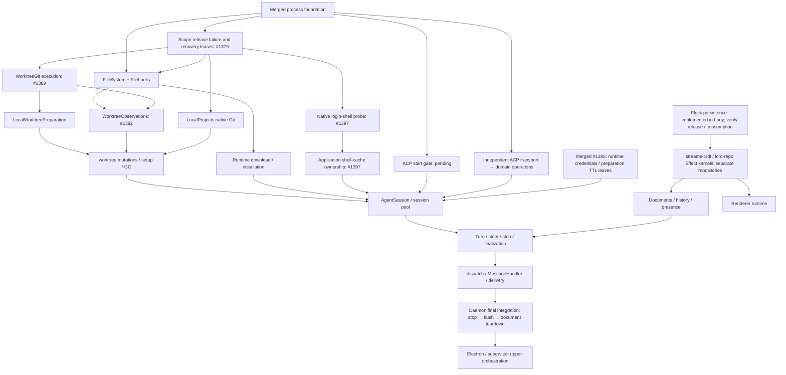
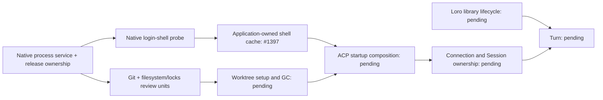

# Lody lifecycle migration roadmap onto Effect

Status: proposed
Translation: current

[中文](2026-09-27-effect-lifecycle-migration-roadmap.zh.md)

## Abstract

Lody's lifecycle defects cluster around a few hand-written mechanisms:

- timer-driven backoff and watchdogs;
- generation counters;
- hand-rolled disposed flags;
- keyed promise chains;
- swallowed `.catch` handlers.

The original survey described Effect 3.18 islands. The merged foundation now uses
Effect 4.0.2 and the official process service with Lody's bounded backend; much of
the daemon's upper orchestration is still Promise-based.

This roadmap sets a bottom-up migration rule:

- seven layers run from the platform to the entry points;
- a unit is done only when its actual dependencies are already Effect services; layer numbers do not impose a global serial schedule;
- our own Promise modules are rewritten, and only real third-party I/O boundaries may be
  wrapped once.

Under that rule, the Loro sync stack's lifecycle is fixed inside the libraries. After the Flock
persistence migration, loro-repo and streams-crdt move to an Effect core that exposes both an
Effect entry and a Promise entry. The first step is the platform and process leaf layers. The
ranking comes from classifying fix commits and issues, not runtime measurement, and each unit
needs its own detailed plan when work starts.

## Runtime revision

The initial survey below describes the v3 baseline. The workspace now uses
Effect 4.0.2; new layers use `Context.Service` and `Layer.effect`, and tests use
`TestClock` from `effect/testing`. See the [v4 migration decision](../../implemented/architecture/2026-10-09-effect-v4-migration.md).

## Basis for the ranking

- **Lifecycle share of fixes.** Of the last three months' 511 fix commits, about 116 are races,
  hangs, leaks, cancellation, or reconnection bugs. Per file, the highest are:
  - `apps/cli/src/lib/message-handler.ts`: 43 of 61 fix commits are lifecycle-related;
  - `session-execution-service.ts`: 34 of 43.
- **Hand-written mechanisms in non-test code** (timers / swallowed catches / disposed-style
  flags, rough counts):

  | Directory                           | Timers | Swallowed catches | Disposed-style flags |
  | ----------------------------------- | ------ | ----------------- | -------------------- |
  | `apps/cli/src/lib`                  | 91     | 70                | 38                   |
  | `packages/components/src/providers` | 51     | 27                | 27                   |
  | `apps/electron/src/main`            | 32     | 10                | 8                    |

  In addition, 83 renderer files hand-write `let cancelled/disposed = false`, and about 35 files
  in `apps/cli/src` use `child_process` or `cross-spawn` directly.

- **Existing Effect footholds:**

  | File                                                          | Effect usage                            |
  | ------------------------------------------------------------- | --------------------------------------- |
  | `apps/cli/src/lib/loro/connection-recovery.ts`                | serial Queue + Fiber event loop         |
  | `packages/components/src/providers/local-reconnect-loop.ts`   | `Clock` + `Fiber`, injectable TestClock |
  | `apps/cli/src/session/session-access-retry.ts`                | `Schedule`                              |
  | `apps/cli/src/lib/pr-poller`                                  | `Layer`                                 |
  | `packages/components/src/lib/code-collab-file-index-cache.ts` | `ScopedCache`                           |

## Layering principle

### Seven layers

Dependencies point downward only.

| Layer               | Contents                                                                                                                                                                | Third-party boundary (wrapped only here)       |
| ------------------- | ----------------------------------------------------------------------------------------------------------------------------------------------------------------------- | ---------------------------------------------- |
| L6 entry adapters   | MessageHandler RPC handlers, dispatch watcher, MCP/Operation delivery; the only place allowed to call `runtime.run*`                                                    | —                                              |
| L5 turn             | TurnService (registry and stop control), TurnProgram, Steer, finalization stages                                                                                        | —                                              |
| L4 session resource | AgentSessionPool (per-session `RcMap`, interruptible create), AgentSession (scope over process, connection, terminals, sandbox), start gate, managed-runtime resolution | —                                              |
| L3 ACP connection   | AcpConnection (requests as Effects, connection-level raw-work set, `closed` Deferred, notification Stream), AgentClient operations, ACP terminals                       | `@agentclientprotocol/sdk`                     |
| L2 state and cloud  | SessionDocuments, SessionHistory, SessionPresence, CloudPort; built on `loro-repo/effect`                                                                               | see the Loro sync stack below                  |
| L1 OS leaf          | ProcessService (spawn, exec, awaitExit, terminateTree with platform strategies), Git, FileSystem, LoginShellEnv                                                         | `node:child_process`, `cross-spawn`, `node:fs` |
| L0 platform         | DaemonRuntime (`ManagedRuntime` + root scope), Clock/TestClock, Logger bridge, Config, Tracing                                                                          | winston, `process.env`                         |

### Definition of done

A module is fully Effect-ified only when every one of these holds:

- its native public API returns Effect with tagged errors; a single-kernel Legacy
  facade may remain only with named callers and an explicit deletion condition;
- every dependency appears in `R` and is provided by a `Layer`, and each dependency is itself done;
- it uses no `setTimeout`/`setInterval`, no `AbortController`, no lifecycle `EventEmitter`, and
  no module-level mutable singletons;
- resources are acquired through `acquireRelease`, `acquireUseRelease`, Scope, or an
  explicitly verified resource container;
- it never calls `run*` internally;
- tests replace Layers and use TestClock to assert observable outcomes.

### Our code versus third-party boundaries

- **Our own Promise modules must be rewritten to this definition.** Examples:
  `LoroDocumentManager`, `SessionDocument`, `AgentClient`, `Session`. They must not merely be
  wrapped in `Effect.tryPromise`, which would leave their lifecycle unmanaged.
- **Only real I/O boundaries may be wrapped once:** Node built-ins, third-party SDKs, database
  drivers, browser APIs.
- **Pure synchronous computation stays plain functions** and does not enter Effect. This
  covers `loro-crdt` and `flock-wasm` encode/decode and merge, and the `history-actions.ts`
  reducer.

### Rules during migration

- **Follow actual dependencies bottom-up.** Layer numbers are a map, not a global
  serial schedule. Independent ACP transport and Loro work can proceed separately;
  an upper unit waits for the particular capabilities it consumes.
- **Temporary facades.** Upper-layer callers not yet migrated use a new service through a
  `runtime.runPromise` facade. The facade is marked temporary and deleted when that upper
  layer migrates.
- **Cross-repository dependencies.** When an unfinished dependency lives in another repository,
  this repository may:
  1. first define a Tag matching that dependency's future Effect interface;
  2. adapt the current Promise version with a temporary Layer;
  3. replace only that Layer once upstream is done.

### Boundary rules

The base PR #1070 provides `.agents/docs/cli-effect-ts.md`; the proposed lifecycle layers
add these boundary requirements:

- never call `run*` inside an Effect;
- use `tryPromise` with the signal for any promise that can reject;
- every interrupt is owned by a scope or awaited;
- timeouts go on the waiter;
- every wait inside a finalizer has a clock/deferred bound that works while uninterruptible;
- ACP shutdown explicitly terminates/closes before raw-work joins or scope close; an ownership
  coordinator retains blocked resources rather than reporting release. See the
  [shutdown-order correction](2026-09-27-effect-turn-execution-and-acp-process-ownership.md#shutdown-order-correction-2026-10-09-effect-400);
- `FiberMap` replacement does not await the old fiber;
- scope close is memoized, because a second `Scope.close` does not wait for the first close's
  finalizers.

## L2 and the Loro sync stack

### Lody's four services

| Service          | Effect concept                                                                                                                                                                                                                        | Replaces                                                                                                                |
| ---------------- | ------------------------------------------------------------------------------------------------------------------------------------------------------------------------------------------------------------------------------------- | ----------------------------------------------------------------------------------------------------------------------- |
| SessionDocuments | `RcMap<SessionId, DocHandle>` whose lookup is `acquireRelease(open and join the room, unload then invalidate)`, with an idle TTL                                                                                                      | `getOrCreateSessionDoc`'s `sessions`, `pendingSessionDocs`, `withLocalDocOwnership`, `isDestroyed`, and hand-written GC |
| SessionHistory   | An interpreter of `HistoryAction`/`MetaPatch` values. `commit(batch)` shields local write sequences from cancellation; this alone provides neither crash recovery nor cross-peer CRDT transactions; changes are exposed as a `Stream` | Promise writes such as `sessionData.commands.applyHistoryAction`, and the `subscribeSessionChanges` callback            |
| SessionPresence  | `hold(sessionId, phase)` is an `acquireRelease` lease with its heartbeat as an in-scope `Effect.repeat(Schedule.spaced)`; machine three-state liveness is a `SubscriptionRef`                                                         | Scattered start/clear calls and ten timers                                                                              |
| CloudPort        | A capability interface whose methods return Effects with tagged errors; callers compose timeouts and retries with `timeout`/`Schedule`; one Layer each for local and cloud                                                            | Promise methods that take `timeoutMs`                                                                                   |

Turn code only produces data such as `HistoryAction`/`MetaPatch` and never sees `LoroDoc` or
loro-repo. Only the SessionHistory and SessionDocuments implementations touch `LoroDoc`, and
handles expose only Effect methods. `applyHistoryAction(entries, action)` in
`packages/shared/src/session-data/history-actions.ts` is already a pure reducer. It can be the
shared core of both the interpreter and the in-memory test Layer.

### Decision: an Effect core for loro-repo and streams-crdt

Most of this layer's defects come from the sync libraries not exposing their lifecycle:

- #4: unload/invalidate ordering;
- #774: a join stuck in connecting forever;
- #399: the watchdog tore down a healthy connection;
- #12: a reconnect storm.

Lody can only compensate from outside, with `connection-recovery.ts` (1087 lines) and the room
management in `doc.ts`. Wrapping the libraries from outside cannot put persistence and
reconnection under Effect, so the decision is to go inside the libraries:

- **Scope.** loro-repo and the layer beneath it, `@loro-dev/streams-crdt`, are migrated
  together:
  - loro-repo: about 12.5k lines in the local 0.19.1 checkout, with 12 timers, 55
    disposed/closed flags and 42 swallowed catches;
  - streams-crdt: about 10k lines in the local 0.15.1 checkout. It holds the reconnect and
    backoff state machine.

  Both checkouts are behind the 0.20.3/0.16.0 versions Lody uses, so these numbers are only
  indicative.

- **Shape.** Both libraries become Effect internally and expose two entries:
  - `loro-repo/effect`: Tags, Layers, handles that need a Scope, and Streams. Lody uses this
    entry directly.
  - the existing Promise API: a thin facade over a `ManagedRuntime`, so other consumers such as
    bitnote, inkpeer and lody-e2ee-core are unaffected.
- **Internal mapping:**

  | Current part                                       | After                                                                                                                         |
  | -------------------------------------------------- | ----------------------------------------------------------------------------------------------------------------------------- |
  | Repo creation and close                            | `Layer.effect`, releasing in order: flush → close transport → close storage                                                   |
  | `doc-manager` cache and `unloadDoc`                | `RcMap<DocId, DocHandle>`; consumers can attach finalizers to a handle, which makes Lody's local room invalidation structural |
  | Room join                                          | a `joinRoom` that needs a Scope; one fiber per attempt, interrupted when superseded; callers compose timeouts                 |
  | Room status callbacks                              | `SubscriptionRef<RoomStatus>` / `Stream`                                                                                      |
  | streams-crdt reconnect and backoff                 | an injectable `Schedule` (exponential, jittered, resetAfter)                                                                  |
  | `flock-debounce`, `meta-persister`                 | `Queue` + `Stream` debounce, flushed when the scope closes                                                                    |
  | `event-bus`                                        | `PubSub` / `Stream`                                                                                                           |
  | sqlite / IndexedDB / filesystem storage            | a `Storage` Tag with one Layer each; handles use `acquireRelease`                                                             |
  | streams / websocket / broadcast-channel transports | a `Transport` Tag with one Layer each                                                                                         |

- **Constraints:**
  - Hot paths stay synchronous functions: CRDT update import/export, per-token update writes,
    and single flock writes. Effect takes over opening, joins, reconnection, persistence
    scheduling and close.
  - `effect` is a peerDependency of both libraries. They share one copy with Lody, at an aligned
    version (currently 4.0.2).
  - The Promise facade must let other consumers' existing tests pass unchanged. That is the
    acceptance condition for the library-side PRs.
- **Order.**
  - Finish the [loro-repo Flock persistence migration](../../implemented/architecture/2026-09-27-loro-repo-flock-persistence-migration.md)
    first, then start the libraries' Effect migration, so the two projects do not rewrite the
    persistence layer at the same time.
  - Each library's migration is its own project, with its own plan in its own repository.
- **Lody is not blocked.**
  - Lody defines its `LoroRepo` Context.Service against the expected `loro-repo/effect` interface.
  - It first adapts the current Promise version with a temporary Layer, registered for deletion.
  - When the libraries publish their Effect entry, only that Layer is replaced. SessionDocuments,
    SessionHistory and SessionPresence stay unchanged.

## Migration units

### Process foundation: implemented, not completion of L0/L1

[#1065](https://github.com/LodyAI/Lody/pull/1065),
[#1069](https://github.com/LodyAI/Lody/pull/1069) and
[#1348](https://github.com/LodyAI/Lody/pull/1348) are merged. The shared core uses
Effect 4.0.2, official ChildProcess/ChildProcessSpawner and Node Stream/Sink
adapters with Lody's bounded tree backend. The CLI process-options module only
composes Layers, and the obsolete promise-facade is deleted. Sandbox acquisition
rolls back and successful command Scopes retire after configuration, whole-tree
exit and drained stdio. Legacy imports stay visible across all process consumers.

File locks are the first subsequent dependency unit; see the
[file-lock decision](../../implemented/architecture/2026-10-10-effect-file-lock-lifecycle.md).
They supply a real filesystem protocol, fair interruptible local admission and
observable cleanup failures. LocalProjects and WorktreeGit execution have native
kernels under draft review; worktree mutation/setup/GC, managed
runtime installation, startup gates, SDK requests, Sessions and Turns remain to
migrate. Process unification does not finish those lifecycles or daemon ownership.

### L2 and the Loro sync stack

See the previous section. Local data plane join/unload joins this unit:

- **Where:** `packages/shared/src/local-loro-data-plane-server.ts`,
  `local-loro-transport.ts`, `apps/cli/src/lib/local-loro-data-plane-server.ts`, and `doc.ts`.
- **Evidence:** #4, `0ec3656a`, `c1a502f7`, #774; open #485 and #398.
- **Target:** room lifecycle moves into the RcMap, and Flock freshness sync falls back to the
  local replica with `timeout` + `orElse`.
- **Constraint:** **"unload, then invalidate" must be preserved.**

### Connection recovery, presence, and machine liveness (CLI)

- **Where:** `apps/cli/src/lib/loro/connection-recovery.ts`, `presence.ts`, `machine-monitor.ts`,
  `session-active-presence.ts`.
- **Evidence:** #12, #673; open #399, #484, #1028.
- **Split:**
  - **Presence and machine liveness** belong to Lody's own L2 (SessionPresence and the machine
    three-state). They can go first on the temporary `LoroRepo` Layer.
  - **Connection recovery** shrinks to policy configuration and health signals once
    streams-crdt/loro-repo take over reconnection with a `Schedule`. It is not rewritten before
    that, to avoid rewriting it twice.
  - **Machine access registration** can move to a background fiber with a `Schedule` on its own,
    first (#1028).
- **Constraints:**
  - First read [`.agents/docs/cli-lib-loro-presence.md`](../../../docs/cli-lib-loro-presence.md) and
    [`cli-lib-local-loro-data-plane.md`](../../../docs/cli-lib-local-loro-data-plane.md), and invoke
    the `lody-loro-sync-stack` skill.
  - Keep the deliberate split between `onStreamsOnline` and `onMetaRoomSynced`.
  - A throttled emit may be delayed, never dropped.

### L3–L5: ACP connection, session resource, and turn

Owned by [turn execution and ACP process ownership](2026-09-27-effect-turn-execution-and-acp-process-ownership.md).
The turn layer depends on L2 and, by the layering rule, finishes last.

### L6: dispatch watcher and MessageHandler

- **Where:** `session-dispatch-watcher.ts` (2874 lines), `session-dispatch-logic.ts`,
  `message-handler.ts` (9762 lines).
- **Evidence:** #676, #166, #1043/#1050 (open #1040), #595, fe26b552; open #939, #553.
- **Target:**
  - one worker fiber per session: `FiberMap` + a sliding `Queue`, or a dirty flag + `Semaphore(1)`;
  - session events become subscriptions on the instance scope, and finalization happens only
    when no turn owns the session;
  - usage flushes retry durably with a `Schedule`;
  - the `runtime.runPromise` facades left by lower layers are deleted.
- **Constraint:** CRDT pointers and duplicate rows still need a data-model fix.

### Managed runtime download and ACP login (an L4 dependency)

- **Where:** `managed-agent-runtime.ts`, `acp-authentication.ts`, `acp-binary-manager.ts`,
  `npx-cache.ts`, `abortable-zip.ts`.
- **Evidence:** #878, #829, #881; open #828, #505.
- **Target:**
  - downward interruption replaces AbortSignal threading;
  - shared installs use `RcMap` or `Deferred` + consumer leases;
  - resumable downloads use a `Schedule`;
  - scratch and partial files use `acquireRelease`;
  - the auth flags become one reason value.
- **Constraints:**
  - Keep every install-cancellation rule in `apps/cli/src/agent/AGENTS.md`.
  - Must finish before L4's RuntimeResolver.

### Worktrees and file locks (an L4/L5 dependency)

- **Where:** `worktree-manager.ts`, `speculative-worktree.ts`, `worktree-gc.ts`,
  `packages/shared/src/node/file-lock.ts`.
- **Evidence:** #76, #6; open #296 (possibly fixed by #620; needs checking).
- File-lock implementation is delivered in #1377; its owning decision defines
  the behavior guarantee and single Legacy facade.
- Remaining work migrates Git/worktree operations and marker admission, with GC
  owned by the daemon Scope. Changing return types or repeating Promise methods
  does not complete these units.

### Orchestration delivery

- **Where:** `operation-coordinator.ts`, `operation-store.ts`.
- **Evidence:** #322, #461, #200; open #675.
- **Target:**
  - a `FiberMap` keyed by operation;
  - `Schedule` for retries and deadlines;
  - one scope per requester session, so Stop can cancel pending deliveries. This depends on the
    turn layer's stop reasons.
- **Outside Effect's control:** the SQLite store's generation fences and cross-process MCP hosts.

### Renderer workspace runtime

- **Where:** `create-workspace-runtime.ts` (4731 lines), `workspace-machine-rpc-facade.ts`,
  `atoms/runtime.ts`, `use-machine-flock-rows.ts`, `use-session-doc.ts`, `atoms/doc-meta.ts`,
  `prompt-shortcut-provider.tsx`.
- **Evidence:** #449, #898, #989; open #480.
- **Target:**
  - split per transport into `Layer.effect`;
  - keyed resources use `RcMap`;
  - presence is cleared only when its scope closes;
  - the React seam stays jotai, subscribing through `useSyncExternalStore` or `atomEffect`,
    without adopting `@effect/atom`.
- **Dependency:** the renderer also uses loro-repo, so this unit starts after
  `loro-repo/effect` is available, which avoids writing a temporary adapter first.
- **Constraint:** most `AGENTS.md` files under components are near the 8 KiB limit, so new rules
  require routing content out first.
- **Where Effect does not apply** (about 60% of renderer lifecycle defects):
  - URL ↔ state two-way sync (#193);
  - derived-state conflicts (#613, #496);
  - virtual-list measurement timing (#695, #896, #674);
  - third-party library behaviour (#722).

### Electron main, the embedded CLI, and cli-supervisor

- **Where:** `apps/electron/src/main/services/cli-service.ts`, `loro-data-plane-relay.ts`,
  `packages/cli-supervisor/src/supervisor.ts`.
- **Evidence:** #849, #742; open #448, #938, #1054.
- **Target:**
  - process spawning and termination migrate to the shared process layer
    in the final cross-runtime consumer PR; #1065 introduces the core;
  - one scope per sender;
  - proxy settings go into a `SubscriptionRef`, with defined restart semantics;
  - the supervisor becomes one fiber + `Schedule`.
- **Constraints:**
  - `apps/electron/AGENTS.md` is at the edge of the 8 KiB limit.
  - Electron main's `node --test` fails on extensionless imports of shared code.

### Low priority

Migrate these only when touched:

- the preview proxy;
- `packages/loro-streams-rpc`;
- the PR poller;
- the Electron updater.

## Fixes that need not wait for Effect

- **#1054:** attach an `error` listener to `DailyRotateFile` and degrade to stderr on ENOSPC,
  instead of an uncaught exit.
- **#448:** wrap the relay's `send` in try, and stop callbacks after `destroyed`.
- **#553:** make the history-sync single-flight join the in-flight run.
- **Close after checking:** #296, and the download half of #828.

## Delivery dependency graph

Arrows mean prerequisites, not a global serial ordering. File locks are the first
new PR; later units start from latest main or an explicit new dependent branch.



The file-lock native-program compatibility projection also depends on #1379;
its kernel continues using the existing pid probe. File locks are reviewed in [#1377](https://github.com/LodyAI/Lody/pull/1377).
Native Git validation exposed swallowed Scope release failure; the independent
correction [#1379](https://github.com/LodyAI/Lody/pull/1379) retains recovery leases.
LocalProjects is reviewed in [#1381](https://github.com/LodyAI/Lody/pull/1381)
above #1379. Its kernel does not depend on FileLocks; worktree setup/GC must
integrate both. WorktreeGit execution is reviewed in
[#1389](https://github.com/LodyAI/Lody/pull/1389); its kernel needs the process
foundation and filesystem, while its review base includes LocalProjects to avoid
repeating manager changes. The native
[worktree observation unit](../../implemented/architecture/2026-10-10-effect-worktree-observations.md)
integrates FileLocks and WorktreeGit on a foundation containing refreshed main.
It does not complete mutation/setup/GC ownership. #1385 is merged and supplies
runtime credential leases and preparation TTL/control only; raw ACP/worktree
startup and full session ownership remain unfinished.
The finite [local-source preparation unit](../../implemented/architecture/2026-10-10-effect-local-worktree-preparation.md) depends on filesystem/Git and borrows the existing mutation lease. Its review base includes observations because their manager boundary is shared; the native kernels are independent.
Library-side prerequisite verification: this integration consumes Flock 0.4.3, streams-crdt 0.16.1 and loro-repo 0.21.1. The public npm registry now publishes streams-crdt 0.16.2 and loro-repo 0.21.2 (Flock remains 0.4.3); these are not consumed upgrades or proof of an Effect kernel. Re-read the upstream rules and reconcile current source/checkpoint contracts before library migration.
These subsequent migration units are draft PRs, not merged work.

Introduce one daemon ManagedRuntime and root Scope when the first real long-lived
services enter composition; extend it as units migrate. The final integration
still preserves the two-phase shutdown contract. A registered temporary upstream
adapter can unblock Lody integration, but does not mark the sync stack complete.
Verify Flock's published and consumed versions and each repository's rules before
library work; the initial local-checkout size/version survey is historical.

## Verification limits

- The ranking and mechanism counts come from git history, issues, and code grep, not runtime
  measurement.
- The loro-repo and streams-crdt numbers come from local checkouts older than the versions Lody
  uses.
- "Likely closes" is inference: each unit must reproduce and verify it during implementation.
- Not assessed:
  - migration effort;
  - Effect's real cost on hot paths and renderer bundle size;
  - the effect on release cadence.

## v4 baseline and PR ownership

[#1070](https://github.com/LodyAI/Lody/pull/1070), the existing Effect consumer and test-tooling
migration to v4, is merged into main. [#1057](https://github.com/LodyAI/Lody/pull/1057) was
merged into its former base branch rather than main; [#1355](https://github.com/LodyAI/Lody/pull/1355)
restores only these bilingual plans onto main.

The former #1355 → #1065 → #1069 → #1348 stack is merged. The shared official
process service retains Lody's bounded backend; its caller migration does not
finish whole L0/L1 or daemon ownership. New reviews use fresh branches and actual
dependency edges. File locks (#1377), Git leaves (#1381/#1389), worktree observations
(#1392) and local preparation (#1394) are review units, not a claim that mutations,
setup/GC or Session cancellation are complete.

The independent [login-shell probe unit](../../implemented/architecture/2026-10-10-effect-login-shell-probe.md)
depends on process release-failure ownership (#1379), not worktree preparation.
Its finite probe and application-owned cache are native in #1397. CLI/Electron
entries now own this service through their root runtime; remaining launchers use
explicit Legacy accessors. This does not finish other daemon owners. Maintain both actual paths:



The finite probe preserves the CLI three-second pending wait while retaining
actual failures. It does not migrate runtime downloads or the startup gate. The
Loro library mainline remains independent; Turn waits for both actual dependency
paths, not a global sequence of layer numbers.

### Current review stack

The seven draft reviews form one linear stack:

```text
main → #1379 → #1377 → #1381 → #1389 → #1392 → #1394 → #1397
```

Each PR targets the preceding PR's head branch and contains that predecessor.
This replaces the temporary worktree/shell integration bases. The order is a
review and merge sequence: LocalProjects does not acquire FileLocks, the Git
execution kernel does not require LocalProjects, and the finite shell probe
requires process ownership rather than worktree preparation. Preserve the actual
dependency diagrams above when planning the next units. Process acquisition error
conversion now retains setup failure and every unresolved recovery lease. These
PRs remain drafts; this stack does not mark any subsequent daemon phase complete.
