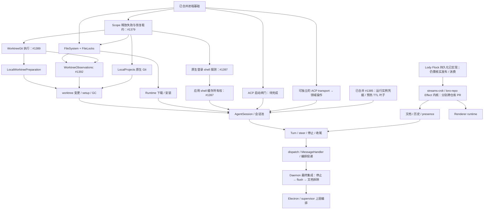
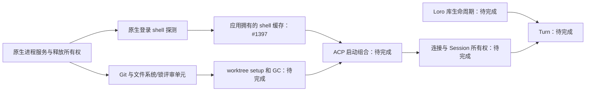

# Lody 生命周期 Effect 迁移路线图

Status: proposed
Translation: current

[English](2026-09-27-effect-lifecycle-migration-roadmap.md)

## 摘要

Lody 的生命周期缺陷集中在少数几类手写机制上：定时器驱动的退避与 watchdog、代际计数器、
手写 disposed 标志、按 key 的 promise 链和被吞掉的 `.catch`。原调查描述 Effect 3.18 孤岛；
已合并的基础现在使用 Effect 4.0.2 与官方进程服务及 Lody 有界后端，上层编排仍有大量 Promise。本路线图确立自底向上的
迁移原则：从平台层到入口层分为七层，每个单元只有在其真实依赖都已是 Effect 服务后才算完成，层号不要求全局串行；
自己的 Promise 模块必须重写，只有真正的第三方 I/O 边界允许包装一次。按这一原则，Loro 同步
栈的生命周期应在库内部解决：loro-repo 与 streams-crdt 在 Flock 持久化迁移之后改为 Effect
内核，同时提供 Effect 与 Promise 两个入口。第一步是平台层与进程叶子层。排序依据是 fix 提交与
issue 分类，不是运行时测量；各单元开工时需要各自的详细计划。

## 运行时修订

下文的初始调研描述的是 v3 基线。工作区现在使用 Effect 4.0.2；新层使用
`Context.Service` 与 `Layer.effect`，测试从 `effect/testing` 导入 `TestClock`。
见 [v4 迁移决定](../../implemented/architecture/2026-10-09-effect-v4-migration.zh.md)。

## 排序依据

- 近三个月 511 个 fix 提交中约 116 个属于竞态、卡死、泄漏、取消、重连类；按文件统计，
  `apps/cli/src/lib/message-handler.ts`（61 个 fix 提交中 43 个与生命周期相关）与
  `session-execution-service.ts`（43 个中 34 个）最高。
- 非测试代码中手写机制的粗略计数（定时器 / 被吞的 catch / disposed 类标志）：
  `apps/cli/src/lib` 91 / 70 / 38，`packages/components/src/providers` 51 / 27 / 27，
  `apps/electron/src/main` 32 / 10 / 8；renderer 有 83 个文件手写 `let cancelled/disposed = false`；
  `apps/cli/src` 中约 35 个文件直接使用 `child_process` 或 `cross-spawn`。
- 现有 Effect 立足点：`apps/cli/src/lib/loro/connection-recovery.ts`（Queue + Fiber 串行事件循环）、
  `packages/components/src/providers/local-reconnect-loop.ts`（`Clock` + `Fiber`，可注入 TestClock）、
  `apps/cli/src/session/session-access-retry.ts`（`Schedule`）、`apps/cli/src/lib/pr-poller`（`Layer`）、
  `packages/components/src/lib/code-collab-file-index-cache.ts`（`ScopedCache`）。

## 分层原则

### 七层

依赖只能向下。

| 层          | 内容                                                                                                                              | 第三方边界（只在此包装一次）                   |
| ----------- | --------------------------------------------------------------------------------------------------------------------------------- | ---------------------------------------------- |
| L6 入口适配 | MessageHandler RPC 处理器、dispatch watcher、MCP/Operation 投递；唯一允许调用 `runtime.run*` 的地方                               | —                                              |
| L5 Turn     | TurnService（注册表与停止控制）、TurnProgram、Steer、收尾阶段                                                                     | —                                              |
| L4 会话资源 | AgentSessionPool（按会话的 `RcMap`，可中断创建）、AgentSession（进程、连接、终端、sandbox 的作用域）、启动闸门、托管 runtime 解析 | —                                              |
| L3 ACP 连接 | AcpConnection（请求即 Effect、连接级原始工作集合、`closed` Deferred、通知 Stream）、AgentClient 操作、ACP 终端                    | `@agentclientprotocol/sdk`                     |
| L2 状态与云 | SessionDocuments、SessionHistory、SessionPresence、CloudPort；下接 `loro-repo/effect`                                             | 见下文 Loro 同步栈                             |
| L1 OS 叶子  | ProcessService（spawn、exec、awaitExit、terminateTree 与平台策略）、Git、FileSystem、LoginShellEnv                                | `node:child_process`、`cross-spawn`、`node:fs` |
| L0 平台     | DaemonRuntime（`ManagedRuntime` + 根作用域）、Clock/TestClock、Logger 桥接、Config、Tracing                                       | winston、`process.env`                         |

### 完成判定

一个模块只有同时满足以下条件才算 Effect 化完成：

- 原生公开 API 返回 `Effect`，失败是带标签的错误类型；单一内核的 Legacy 门面只能在
  记录具体调用方和删除条件后暂时保留；
- 依赖全部出现在 `R` 中，由 `Layer` 提供，且这些依赖本身已完成；
- 不使用 `setTimeout`/`setInterval`、`AbortController`、生命周期 `EventEmitter` 或模块级可变单例；
- 资源通过 `acquireRelease`、`acquireUseRelease`、Scope 或明确验证过的资源容器获取；
- 内部不调用 `run*`；
- 测试通过替换 Layer 与 TestClock 断言可观察结果。

### 自己的代码与第三方边界

- 自己的 Promise 模块（例如 `LoroDocumentManager`、`SessionDocument`、`AgentClient`、`Session`）
  必须按上述判定重写，不能只在外面套一层 `Effect.tryPromise`，否则生命周期仍无人管理。
- 只有真正的 I/O 边界允许包装一次：Node 内建模块、第三方 SDK、数据库驱动、浏览器 API。
- 纯同步计算（`loro-crdt`、`flock-wasm` 的编解码与合并，`history-actions.ts` 的 reducer）
  保持普通函数，不进入 Effect。

### 迁移期规则

- 按真实依赖自底向上：层号不是全局串行要求。ACP transport 与 Loro 可独立推进；
  上层只等待它实际消费的能力完成。
- 尚未迁移的上层调用方经 `runtime.runPromise` 门面使用新服务；门面标注为临时，并在对应上层
  迁移时删除。
- 当依赖属于另一个仓库且尚未完成时，允许在本仓库先定义与其未来 Effect 接口一致的 Tag，
  用临时 Layer 适配现有 Promise 版本；上游完成后只替换该 Layer。

### 边界规则（使用指南已由基础 PR #1070 提供，生命周期层补充以下要求）

不在 Effect 内调用 `run*`；可拒绝的 promise 用带 signal 的 `tryPromise`；中断必须被某个作用域
持有或被等待；超时放在等待者上；finalizer 内的等待必须有上限；`FiberMap` 替换不等待旧 fiber；
作用域关闭必须记忆化，因为第二次 `Scope.close` 不等待第一次的 finalizer。finalizer 内采用在
不可中断区域也能结束的时钟/Deferred 上限；ACP 关停由协调器先显式终止/关闭、再 join 原始
工作和关闭 scope。仍被阻塞的资源保留拥有者，不能报告释放。详见
[关停顺序修正](2026-09-27-effect-turn-execution-and-acp-process-ownership.zh.md#关停顺序修正2026-10-09effect-400)。

## L2 与 Loro 同步栈

### Lody 侧的四个服务

| 服务             | Effect 概念                                                                                                                                                | 取代                                                                                                          |
| ---------------- | ---------------------------------------------------------------------------------------------------------------------------------------------------------- | ------------------------------------------------------------------------------------------------------------- |
| SessionDocuments | `RcMap<SessionId, DocHandle>`，lookup 为 `acquireRelease(打开并加入 room, 先 unload 再 invalidate)`，带 idle TTL                                           | `getOrCreateSessionDoc` 的 `sessions`、`pendingSessionDocs`、`withLocalDocOwnership`、`isDestroyed` 与手写 GC |
| SessionHistory   | 执行 `HistoryAction`/`MetaPatch` 值的写入器；`commit(batch)` 避免本地取消打断写入序列；不可中断本身不提供崩溃恢复或跨 peer CRDT 事务；变化以 `Stream` 暴露 | `sessionData.commands.applyHistoryAction` 等 Promise 写入与 `subscribeSessionChanges` 回调                    |
| SessionPresence  | `hold(sessionId, phase)` 为 `acquireRelease` 租约，心跳为作用域内的 `Effect.repeat(Schedule.spaced)`；机器三态用 `SubscriptionRef`                         | 分散的 start/clear 调用与十个定时器                                                                           |
| CloudPort        | 能力接口，方法返回带标签错误的 Effect；超时与重试由调用方用 `timeout`/`Schedule` 组合；local 与 cloud 各一个 Layer                                         | 接收 `timeoutMs` 的 Promise 方法                                                                              |

turn 代码只产出 `HistoryAction`/`MetaPatch` 这类数据，看不到 `LoroDoc` 或 loro-repo；只有
SessionHistory 与 SessionDocuments 的实现能接触 `LoroDoc`，handle 对外只暴露 Effect 方法。
`packages/shared/src/session-data/history-actions.ts` 中 `applyHistoryAction(entries, action)`
已是纯 reducer，可直接作为写入器与内存测试 Layer 的共同核心。

### 决定：loro-repo 与 streams-crdt 改为 Effect 内核

Lody 这一层的缺陷（#4 unload/invalidate 顺序、#774 join 永久停在 connecting、#399 watchdog 拆掉
健康连接、#12 重连风暴）大多源于同步库没有交出生命周期，Lody 只能在外面用
`connection-recovery.ts`（1087 行）与 `doc.ts` 的 room 管理补偿。只在外面包装无法让持久化与
重连归 Effect 管理，因此决定深入库内部：

- **范围**：loro-repo（本地 0.19.1 检出约 1.25 万行，12 处定时器、55 处 disposed/closed 标志、
  42 处被吞的 catch）与其下层 `@loro-dev/streams-crdt`（本地 0.15.1 检出约 1 万行，重连与退避
  状态机所在）一起改造。两个本地检出都落后于 Lody 使用的 0.20.3/0.16.0，数字只作量级参考。
- **形态**：库内部全部用 Effect；对外同时提供 `loro-repo/effect`（Tag、Layer、需要 Scope 的
  handle、Stream）与现有 Promise API。后者是基于 `ManagedRuntime` 的薄门面，使 bitnote、inkpeer、
  lody-e2ee-core 等其他使用方不受影响。Lody 直接使用 Effect 入口。
- **内部对应**：

  | 现有部分                                     | Effect 化后                                                                                           |
  | -------------------------------------------- | ----------------------------------------------------------------------------------------------------- |
  | Repo 创建与关闭                              | `Layer.effect`，释放顺序为 flush → 关 transport → 关 storage                                          |
  | `doc-manager` 缓存与 `unloadDoc`             | `RcMap<DocId, DocHandle>`，消费方可在 handle 上挂 finalizer（Lody 的本地 room invalidate 由此结构化） |
  | room join                                    | 需要 Scope 的 `joinRoom`，每次尝试一个 fiber，被取代即中断，超时由调用方组合                          |
  | room 状态回调                                | `SubscriptionRef<RoomStatus>` / `Stream`                                                              |
  | streams-crdt 重连与退避                      | 可注入的 `Schedule`（exponential、jittered、resetAfter）                                              |
  | `flock-debounce`、`meta-persister`           | `Queue` + `Stream` 防抖，作用域关闭时 flush                                                           |
  | `event-bus`                                  | `PubSub` / `Stream`                                                                                   |
  | sqlite / IndexedDB / 文件系统存储            | `Storage` Tag，各一个 Layer，句柄用 `acquireRelease`                                                  |
  | streams / websocket / broadcast-channel 传输 | `Transport` Tag，各一个 Layer                                                                         |

- **约束**：
  - 热路径（CRDT update 导入导出、按 token 流入的更新写入、单次 flock 写入）保持同步函数，
    Effect 只接管打开、join、重连、持久化调度与关闭。
  - `effect` 作为两个库的 peerDependency，与 Lody 共用同一份并对齐版本（当前 4.0.2）。
  - Promise 门面必须让其他使用方的现有测试不改即通过，作为库侧 PR 的验收条件。
- **顺序**：先完成 [loro-repo Flock 持久化迁移](../../implemented/architecture/2026-09-27-loro-repo-flock-persistence-migration.zh.md)，
  再开始库的 Effect 改造，避免两项工作同时改写持久化层。库的改造在各自仓库立项、各自出计划。
- **Lody 不被阻塞**：Lody 侧按 `loro-repo/effect` 的预期接口定义 `LoroRepo` Context.Service，先用临时 Layer
  适配现有 Promise 版本并登记删除；库发布 Effect 入口后只替换该 Layer，SessionDocuments、
  SessionHistory、SessionPresence 不变。

## 迁移单元

### 进程基础：已实现，但不代表整个 L0/L1 完成

[#1065](https://github.com/LodyAI/Lody/pull/1065)、
[#1069](https://github.com/LodyAI/Lody/pull/1069)、
[#1348](https://github.com/LodyAI/Lody/pull/1348) 均已合并。共享核心使用 Effect 4.0.2、
官方 ChildProcess/ChildProcessSpawner 与 Node Stream/Sink，保留 Lody 有界进程树后端。
CLI process-options 只组合 Layer，旧 promise-facade 已删除。Sandbox 失败或中断回滚，
成功命令在配置完成、整棵树退出和 stdio 关闭后释放子 Scope；所有进程消费保留 Legacy 可见。

文件锁是之后第一个依赖单元，见[文件锁决定](../../implemented/architecture/2026-10-10-effect-file-lock-lifecycle.zh.md)：
真实文件协议、公平且可取消的本地登记、可观察的清理失败。LocalProjects 和 WorktreeGit 执行已有待审的原生内核；worktree 变更/setup/GC、
runtime 安装、启动闸门、SDK 请求、Session 与 Turn 仍需迁移；进程统一
不代表这些生命周期或 daemon 所有权已完成。

### L2 与 Loro 同步栈

见上一节。本地数据面 join/unload（`packages/shared/src/local-loro-data-plane-server.ts`、
`local-loro-transport.ts`、`apps/cli/src/lib/local-loro-data-plane-server.ts`、`doc.ts`，证据
#4、`0ec3656a`、`c1a502f7`、#774，开放 #485、#398）并入此单元：room 生命周期进入 RcMap，
Flock 新鲜度同步用 `timeout` + `orElse` 回落本地副本。约束：**必须保持"先 unload 再 invalidate"**。

### 连接恢复、presence 与机器存活（CLI）

- 位置：`apps/cli/src/lib/loro/connection-recovery.ts`、`presence.ts`、`machine-monitor.ts`、
  `session-active-presence.ts`。
- 证据：#12、#673；开放 #399、#484、#1028。
- 拆分：presence 与机器存活属于 Lody 自己的 L2（SessionPresence 与机器三态），可在临时
  `LoroRepo` Layer 上先行；连接恢复在 streams-crdt/loro-repo 以 `Schedule` 接管重连后收缩为
  策略配置与健康信号，在此之前不重写，避免两次改写。机器访问注册改为带 `Schedule` 的后台
  fiber 可独立先做（#1028）。
- 约束：先读 [`.agents/docs/cli-lib-loro-presence.md`](../../../docs/cli-lib-loro-presence.md) 与
  [`cli-lib-local-loro-data-plane.md`](../../../docs/cli-lib-local-loro-data-plane.md)，并先调用
  `lody-loro-sync-stack` skill；保留 `onStreamsOnline` 与 `onMetaRoomSynced` 的刻意拆分，被节流的
  emit 只能延后不能丢弃。

### L3–L5：ACP 连接、会话资源与 Turn

由 [Turn 执行与 ACP 进程所有权](2026-09-27-effect-turn-execution-and-acp-process-ownership.zh.md)
负责。Turn 层依赖 L2，按分层原则最后完成。

### L6：Dispatch watcher 与 MessageHandler

- 位置：`session-dispatch-watcher.ts`（2874 行）、`session-dispatch-logic.ts`、
  `message-handler.ts`（9762 行）。
- 证据：#676、#166、#1043/#1050（开放 #1040）、#595、fe26b552；开放 #939、#553。
- 目标：每会话一个 worker fiber（`FiberMap` + sliding `Queue` 或"脏标记 + `Semaphore(1)`"）；
  会话事件改为实例作用域上的订阅，收尾只在无拥有者 turn 时发生；用量 flush 用 `Schedule` 持久
  重试；删除各层留下的 `runtime.runPromise` 门面。
- 约束：CRDT 指针与重复行仍需数据模型层面修复。

### 托管 runtime 下载与 ACP 登录（L4 的依赖）

- 位置：`managed-agent-runtime.ts`、`acp-authentication.ts`、`acp-binary-manager.ts`、`npx-cache.ts`、
  `abortable-zip.ts`。
- 证据：#878、#829、#881；开放 #828、#505。
- 目标：中断向下传播取代逐层 AbortSignal；共享安装用 `RcMap` 或 `Deferred` + 消费者租约；
  续传用 `Schedule`；scratch 与 partial 文件用 `acquireRelease`；认证标志改为单一原因值。
- 约束：`apps/cli/src/agent/AGENTS.md` 的安装取消规则逐条保留。须在 L4 的 RuntimeResolver 之前完成。

### Worktree 与文件锁（L4/L5 的依赖）

- 位置：`worktree-manager.ts`、`speculative-worktree.ts`、`worktree-gc.ts`、
  `packages/shared/src/node/file-lock.ts`。
- 证据：#76、#6；开放 #296（可能已被 #620 修复，需核实）。
- 文件锁内核已在 #1377 实现；其行为保证与单一 Legacy 门面以所属决定为准。
- 剩余目标：迁移 Git/worktree 操作与 marker 排队；GC 由 daemon Scope 拥有。仅改变函数返回类型、或让计时循环调用 Promise 方法，不构成这些单元完成。

### 编排投递

- 位置：`operation-coordinator.ts`、`operation-store.ts`。
- 证据：#322、#461、#200；开放 #675。
- 目标：按 operation 的 `FiberMap`、`Schedule` 重试与期限、每个请求方会话一个作用域，使 Stop
  能取消挂起投递（依赖 Turn 层的停止原因）。SQLite store 的代际栅栏与跨进程 MCP host 不受
  Effect 控制。

### Renderer workspace runtime

- 位置：`create-workspace-runtime.ts`（4731 行）、`workspace-machine-rpc-facade.ts`、`atoms/runtime.ts`、
  `use-machine-flock-rows.ts`、`use-session-doc.ts`、`atoms/doc-meta.ts`、`prompt-shortcut-provider.tsx`。
- 证据：#449、#898、#989；开放 #480。
- 目标：按 transport 拆成 `Layer.effect`；按 key 的资源用 `RcMap`；presence 只在作用域关闭时清空；
  React 接缝保持 jotai，通过 `useSyncExternalStore` 或 `atomEffect` 订阅，不引入 `@effect/atom`。
- 依赖：renderer 同样使用 loro-repo，应在 `loro-repo/effect` 可用后开始，避免先写临时适配。
- 约束：components 下多数 `AGENTS.md` 接近 8 KiB 上限，新增规则前需要转移内容。
- 不适用 Effect 的部分（约占 renderer 生命周期缺陷六成）：URL 与状态双向同步（#193）、派生
  状态冲突（#613、#496）、虚拟列表测量时序（#695、#896、#674）、第三方库行为（#722）。

### Electron main、内嵌 CLI 与 cli-supervisor

- 位置：`apps/electron/src/main/services/cli-service.ts`、`loro-data-plane-relay.ts`、
  `packages/cli-supervisor/src/supervisor.ts`。
- 证据：#849、#742；开放 #448、#938、#1054。
- 目标：CLI 子进程与各处进程终止在最后的跨运行时 PR 迁到共享进程层；#1065 先引入核心；每个 sender 一个
  作用域；代理设置放进 `SubscriptionRef` 并定义重启语义；supervisor 改为单个 fiber + `Schedule`。
- 约束：`apps/electron/AGENTS.md` 已在 8 KiB 上限边缘；electron main 的 `node --test` 对 shared
  的无扩展名导入会失败。

### 低优先级

preview 代理、`packages/loro-streams-rpc`、PR poller、Electron updater：只在触及时顺带迁移。

## 不需要等 Effect 的独立修复

- #1054：给 `DailyRotateFile` 挂 `error` 监听，ENOSPC 时降级到 stderr 而不是 uncaught 退出。
- #448：relay 的 `send` 包 try，并在 `destroyed` 后停止回调。
- #553：历史同步 single-flight 改为加入进行中的那一次。
- 核实后关闭：#296、#828 的下载部分。

## 交付依赖图

箭头表示前置依赖，不是全局串行顺序。文件锁是第一份新 PR；后续单元从最新 main 或
明确的新依赖分支开始。



文件锁门面的原生程序错误投影同样依赖 #1379，内核仍使用既有 pid 探测；文件锁由 [#1377](https://github.com/LodyAI/Lody/pull/1377) 审查。原生 Git 验证发现 Scope 释放失败曾被吞掉，独立修复 [#1379](https://github.com/LodyAI/Lody/pull/1379) 保留恢复租约。LocalProjects 在 #1379 之上的 [#1381](https://github.com/LodyAI/Lody/pull/1381) 审查，其内核不依赖 FileLocks；worktree setup/GC 需要同时集成两者。WorktreeGit 执行由 [#1389](https://github.com/LodyAI/Lody/pull/1389) 审查，内核只依赖进程基础和文件系统；为避免重复管理器改动，评审 base 包含 LocalProjects。
原生 [worktree 观察单元](../../implemented/architecture/2026-10-10-effect-worktree-observations.zh.md)
在包含刷新 main 的基础上组合 FileLocks 和 WorktreeGit，不代表变更、setup 或 GC 所有权完成。
#1385 已合并，仅提供运行实例凭据租约和预热 TTL/控制；底层 ACP/worktree 启动及完整会话所有权仍未完成。
有限[本地源准备单元](../../implemented/architecture/2026-10-10-effect-local-worktree-preparation.zh.md) 依赖文件系统/Git，借用既有变更租约。评审 base 包含观察单元，因为管理器边界共享；原生内核并不互相依赖。
库侧前置核对：本集成消费 Flock 0.4.3、streams-crdt 0.16.1 和 loro-repo 0.21.1。公开 npm registry 现已发布 streams-crdt 0.16.2 和 loro-repo 0.21.2，Flock 仍为 0.4.3；这不是已消费的升级，也不证明 Effect 内核完成。库侧迁移前仍须读取各自规则并核对当前源码/检查点契约。
这些后续迁移单元仍是 draft PR，不能标为已合并。

接入首个真正长生命周期服务时建立统一 daemon ManagedRuntime 与根 Scope，随单元迁移扩展；
最终集成继续保留两阶段关停。已登记删除条件的临时上游适配可解除 Lody 集成阻塞，但不能
把同步栈宣称为完成。库侧工作前核实 Flock 发布/消费版本和各仓库规则；原本地检出版本与
规模调查仅为历史。

## 验证边界

排序与机制计数来自 git 历史、issue 与代码 grep，不是运行时测量；loro-repo 与 streams-crdt 的
数字来自落后于 Lody 所用版本的本地检出。"可能关闭"的 issue 是推断，需要各单元实施时复现与
验证。未评估迁移工作量、Effect 对热路径与 renderer 包体积的实际开销，以及对发布节奏的影响。

## v4 基线与 PR 职责

[#1070](https://github.com/LodyAI/Lody/pull/1070) 的已有 Effect 调用与测试工具 v4 迁移
已合入 main。[#1057](https://github.com/LodyAI/Lody/pull/1057) 合入了原基础分支而非 main；
[#1355](https://github.com/LodyAI/Lody/pull/1355) 只将这两份中英文计划恢复到 main。

此前 #1355 → #1065 → #1069 → #1348 已合并。共享官方进程服务保留 Lody 有界后端，
调用方迁移不等于整个 L0/L1 或 daemon 所有权完成。新评审使用新分支及实际依赖边；
文件锁 #1377、Git 叶子 #1381/#1389、worktree 查询 #1392 和本地准备 #1394 是评审
单元，不宣称 mutations、setup/GC 或 Session 取消已完成。

独立的[登录 shell 探测单元](../../implemented/architecture/2026-10-10-effect-login-shell-probe.zh.md)
依赖进程释放失败所有权 #1379，不依赖 worktree 准备。#1397 已原生化有限探测与
应用缓存；CLI/Electron 入口通过根 runtime 拥有此服务，剩余启动器使用显式 Legacy
访问器，不代表其它 daemon 拥有者已迁移。维护两个真实路径：



有限探测保留 CLI 三秒 pending 等待，同时保留实际失败；它不迁移 runtime 下载或启动
闸门。Loro 库主线保持独立；Turn 等待真实两边依赖，而非按层号全局串行。

### 当前评审 stack

七个 draft 评审组成一条线性 stack：

```text
main → #1379 → #1377 → #1381 → #1389 → #1392 → #1394 → #1397
```

每份 PR 以其前一份 PR 的 head 分支为 base，并包含该前置分支，替代临时 worktree/shell 整合 base。这是评审与合并顺序：LocalProjects 不获取 FileLocks，Git 执行内核不要求 LocalProjects，有限 shell 探测依赖进程所有权，不依赖 worktree 准备。后续规划继续保留上面的真实依赖图。进程获取错误转换现已保留配置失败和全部未解决的恢复租约。这些 PR 仍是 draft，stack 不代表后续 daemon 阶段完成。
