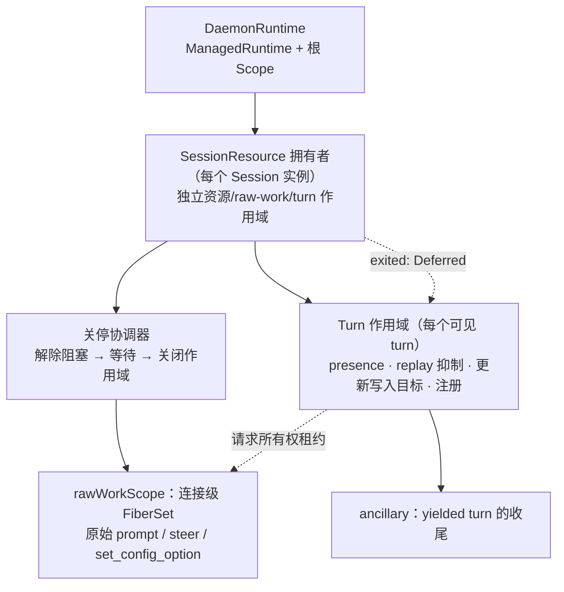

# 用 Effect 作用域重建 Turn 执行与 ACP 进程所有权

Status: proposed
Translation: current

[English](2026-09-27-effect-turn-execution-and-acp-process-ownership.md)

## 摘要

CLI 的 Turn 执行运行时与 ACP 子进程关停是近两个月生命周期缺陷最密集的区域：取消后所有权
提前释放、drain 等错对象、失败实例的事件终结了活动 turn、初始化无期限、Windows 残留子孙
进程。它们同属一类根因——资源或等待的生命周期没有绑定到拥有者，只能靠约 15 个布尔标志、
十余个按会话登记的 Map 和五份各不相同的 kill 实现维持。本提案把所有权改为三层 Effect
作用域（守护进程 → 会话资源 → turn）：进程与 ACP 连接由会话资源作用域获取和释放，原始 ACP
请求的所有权保留到请求真正结束。关停协调器先 drain，超限后显式终止进程并关闭连接，再等待
请求 fiber 和关闭作用域；停止原因是类型化值，所有等待都有上限并显式升级。交付遵循[迁移路线图](2026-09-27-effect-lifecycle-migration-roadmap.zh.md)的
自底向上分层原则：先做平台层与进程叶子层，再做 ACP 连接、会话资源，Turn 层在其依赖的状态层
完成后最后完成；不改变 Stop/steer 的用户语义、历史格式与 dispatch 指针规则。各阶段的预期收益
尚未验证，Windows 进程树与"终止失败后是否隔离会话"两项需要人工决定。

## 进程基础交付状态

进程基础与调用方系列 #1065、#1069、#1348 均已合并，但 AcpConnection、Session 和 Turn
端到端取消尚未完成。后续单元和实际依赖统一维护于[路线图依赖图](2026-09-27-effect-lifecycle-migration-roadmap.zh.md#交付依赖图)。
新工作从刷新后的 main 开始；下文原 stack 描述仅保留为历史计划。

## 问题与证据

### 缺陷记录

| 根因类别                                      | 已修复实例                                 | 仍开放                                                |
| --------------------------------------------- | ------------------------------------------ | ----------------------------------------------------- |
| 取消后所有权提前释放 / 原始请求比拥有者活得久 | #571、#618、#740（#477、#666）、#573、#847 | #738（待复现归因）                                    |
| drain 等错对象                                | #817（handoff steer 后 5 秒 SIGKILL）      | —                                                     |
| 已脱离实例的事件终结活动 turn                 | #595、bounded-init 的两次评审修正          | stale-ACP 重试路径（未验证，见下）                    |
| 无期限等待                                    | #759（初始化挂 1h51m）                     | `killAndWait` 强制分支、taskkill 无期限               |
| 进程树未清理                                  | —                                          | #429（Windows 子孙残留；#456/#457/#458 未合并即关闭） |

相关决策记录：[steer Stop 与恢复所有权](../../implemented/bug-fix/2026-09-16-steer-stop-recovery-ownership.zh.md)、
[有期限的会话初始化](../../implemented/bug-fix/2026-09-16-bounded-session-initialization.zh.md)、
[中断时待处理输入恰好一次](../../implemented/bug-fix/2026-09-14-interrupt-pending-input-exactly-once.zh.md)、
[失败创建的生命周期事件](../../implemented/bug-fix/2026-09-11-failed-session-create-lifecycle-events.zh.md)、
[原生压缩取消](../../implemented/bug-fix/2026-09-12-native-compaction-cancellation.zh.md)，以及仍为提案的
[Codex prompt 占用与恢复](../bug-fix/2026-09-10-codex-prompt-ownership-recovery.zh.md)。本提案实现后者
"AgentClient 持有真实请求直到结束"这一第一阶段结构，并把它推广到所有 turn 资源；不实现其第二阶段
（执行记录与恢复入口统一）。

### 代码现状（`HEAD` 963752f8）

执行服务 `apps/cli/src/session/session-execution-service.ts`（6890 行）：

- `TurnRuntimeState`（约 :270-318）用 `promptStarted`、`promptInFlight`、`finalizeStarted`、
  `finalizeCompleted`、`cancelRequested`、`cancelFinalized`、`interruptRequested`、
  `terminateSessionOnCancel`、`initializationStalled` 等标志，加上 `steerWaitController`、
  `cancellationDrain`、`pendingHandoffSteerOutcome`、`pendingSteerConfig`、`yieldedFinalization`
  promise 链来表达一个 turn 处于什么阶段、为什么结束。
- turn 的"活着"有三份事实：MessageHandler 的 `activeTurnId`（ACP 更新写入目标）、
  `currentTurnBySession`、`turnRuntimeBySession`；另有 `canceledTurnBySession`、
  `turnReleaseWaiters`、`initializationStallWaiters` 等登记表。
- turn 程序已经是一个 Effect（`runVisibleSessionTurn`，约 :3350-3730），但：
  - 用 `Effect.runFork(program)` 在默认运行时上启动根 fiber，守护进程关停时无法枚举或等待；
  - finalizer 靠 `Cause.isInterrupted` 加可变标志区分停滞、取消和中断（bounded-init 记录
    已说明直接中断会被误判为用户取消）；
  - `requestTurnInterrupt` 是 `void Effect.runPromise(Fiber.interrupt(fiber))`，不等 finalizer；
  - finalizer 内 `Effect.promise(() => yieldedFinalization)` 是无上限等待；
  - `drainCancelledPrompt` 在 Stop 路径以脱离作用域的 promise 运行，5 秒 `withTimeout` 后再
    检查"超时后是否刚好赢了"；
  - `finalizeTurn` 是 promise，Stop 中断 fiber 后它继续跑，只能在各阶段之间轮询
    `stopIfTurnCancelled`，并在发送完成通知前再查一次。
- `cancelSession`（约 :5666-5895）有八个分支，按 `promptInFlight`、`finalizeStarted`、
  是否有 runtime、ACP 是否就绪等组合决定是中断 fiber、发 ACP cancel 加后台 drain，
  还是直接调用 `finalizeCancelledTurn`。
- 文件后三分之一（约 :5897-6850）是机器级 ACP 认证、能力刷新和二进制安装，与 turn 无关。

`apps/cli/src/agent/agent-client.ts`（2997 行）：`pendingPrompts` Set 记录原始请求，
`pendingPromptCompletion` 暴露其 `allSettled`；`prompt()` 用 `Promise.race` 等原始请求或
AbortSignal，abort 时发 ACP cancel 并立即 reject；`steerPrompt` 用 `steerApplicationWaiters`
与多个 `void promise.then` 维护 applied/not-applied/unknown 三态。

进程层（`session.ts`、`session-sandbox.ts`、`acp-runner.ts`、`session-manager.ts`）：

- `Session.terminate` 不合并并发调用；`killAndWait` 只看 `exitCode`，不看 `signalCode`；
  强制分支 `await waitForExit()` 无上限；优雅分支 `Promise.race` 的 5 秒计时器从不清除。
- `sandbox.terminate` 失败被吞掉后仍 emit `terminated`；`terminated` 的 `exitCode` 取自
  exec 进程而不是 agent。
- Windows 下 Noop sandbox 用 `taskkill /T` 但忽略退出码、无期限，并使用缓存 PID；
  `acp-runner.ts` 的辅助进程在 Windows 上只 `child.kill` 外层 wrapper。
- ACP 根进程自行退出后，同进程组的后代不再被任何路径发信号。
- **ACP 进程意外死亡不产生任何事件**：`onExit` 只把 `agentProcess` 置空，`connection` 不关闭，
  `isCreated()` 仍为 true。SDK（`@agentclientprotocol/sdk` 1.3.0 `jsonrpc.js` `close()`）只在
  stdout 读到 EOF 时 reject 挂起请求；若孙进程仍持有管道，EOF 不会到来。
- `SessionManager` 的 `exit`/`terminated` 监听按 **id** 删除 `sessions[id]`，
  未 detach 的旧实例可以注销替代者；MessageHandler 收到 `terminated` 后以无 turnId 的
  `finalizeACPState(sessionId)` 收尾整个 turn。stale-ACP 重试路径（执行服务约 :4837）终止的是
  仍登记的旧实例，与 #595 同类，但尚未复现。
- 至少五份 SIGTERM→等待→SIGKILL 实现：`session.ts`、`acp-runner.ts`、`session-sandbox.ts`、
  `acp-authentication.ts` 状态探测、`packages/cli-supervisor`。

### Effect 已验证的行为（effect 3.18.4）

调研在同版本副本上用临时脚本实测（脚本已删除），结论决定了下文设计中的几个细节：

- `Scope.close(scope, exit)` 把 exit 传给每个 `acquireRelease` 的 release；以 `Exit.fail(reason)`
  关闭即可把类型化原因交给 finalizer。第二次 `Scope.close` 立即返回、不等第一次的 finalizer，
  因此"关闭"必须是一个被记忆化的共享操作，先到的原因胜出。
- `Effect.forkIn(effect, scope)` 的 fiber 在作用域关闭时被中断**并等待**；对不可中断的工作，
  关闭会等它真正结束。这能保住请求所有权，却不能保证关停顺序；下文的 v4 修正取代这条推论。
- `Effect.timeout` 作用在不可中断的工作上时会等工作结束；要"有上限地等"，必须把 timeout
  放在等待者上：`Fiber.await(raw).pipe(Effect.timeoutTo(...))`。
- `Fiber.interrupt` 等待 finalizer，`Fiber.interruptFork` 不等；`Effect.disconnect` 让工作
  在后台继续、调用方立即返回，语义上等于放弃所有权，本设计不用。
- `FiberMap.run` 同 key 替换时**不等待**旧 fiber 的 finalizer；需要"一个会话一个进程"时必须
  显式中断并等待，或用每 key 的 `Semaphore(1)` 串行。
- `ManagedRuntime.make(TestContext.TestContext)` 可以用 `TestClock.adjust` 驱动 `runFork`
  出去的 `sleep`，因此注入运行时就是时间测试的接缝；vitest 默认 fake timers 会冻结 Effect
  调度器（见现有测试只 fake `setInterval` 的做法）。
- `@effect/platform` 的 `Command` 在 POSIX 上 detached + 进程组 kill、Windows 上 `taskkill /T /F`，
  但释放时只 SIGTERM 然后无限等 `exit`，不升级、不设期限，并会合并 `process.env`；与
  "过滤环境变量启动子进程"的规则冲突，且需要锁定 0.92.x 或升级 effect。**不采用**，
  自建一层薄封装。

## 运行时修订

上面的实验是历史 v3 证据，不能当作 v4 的验证。已实现的基础层现在使用
Effect 4.0.2，见 [v4 迁移记录](../../implemented/architecture/2026-10-09-effect-v4-migration.zh.md)。
后续代码使用 `Layer.effect`、`Scope.provide`、`Fiber.Fiber` 和
`Effect.forkChild` / `forkIn`，测试时钟从 `effect/testing` 导入。

### 关停顺序修正（2026-10-09，Effect 4.0.0）

原提案错误地依赖“关闭会话作用域”来终止进程、从而结束请求。默认串行 finalizer 按注册反序
运行：后注册的 `forkIn` 或 `FiberSet` 会先中断并等待请求 fiber；不可中断的请求却要等前面注册
的进程 finalizer 执行才能结束。改成并行 finalizer，或在 `Scope.close` 外套 timeout，都不能
保证所需的先后顺序。

改为显式协调器，分别持有请求的 `rawWorkScope` 和进程/连接/终端的 `resourceScope`。用
`Scope.make` 创建并由会话拥有者保留；在获取资源或启动请求之前，先注册协调器的外层 finalizer。
不能通过 `Scope.fork`、在资源/daemon scope 上 `forkIn`，或外层 scoped `FiberSet`，自动把
raw-work 的关闭排到协调器之前。`FiberSet` 只放在 `rawWorkScope`。turn scope 也只能经协调器
关闭；body finalizer 不能先于协调器 drain 或 join 原始请求。普通 Stop、创建中断、
获取失败、agent 退出、运行时 dispose 全部走同一协调器。

```text
禁止正在停止的 turn 发新请求 + 记录停止原因
  → 有上限地 ACP cancel、drain（普通 Stop：5 秒）
  → 超限/丢弃/关停：有上限地 terminateTree + 显式关闭连接
  → 有上限地等原始请求和 turn body
  → 按原因写入 → 关闭 turn/raw-work/resource scope → released
```

普通 drain 成功且旧拥有者已释放后，可复用连接才能接收下一 turn；丢弃或升级终止会永久
禁止整个会话接收请求。`close(reason)` 必须同步禁止新请求，通过连接关闭信号结束所有本地请求
包装，不依赖 stdout EOF 或 SDK Promise 完成；迟到响应不能写入已释放的 turn。本地包装结束不等于远端进程已死。
终止进程与关闭连接分别尝试：捕获终止失败之后仍要关闭连接。退出 watcher 只发布信号，不能
等待之后要 join 它自己的协调器。任何 join 都不能排在能够解除它阻塞的操作之前。

协调器的 finalizer 采用在不可中断区域也能结束的时钟/Deferred 上限，不能只给不可中断 join
套 timeout。只有相关工作全部结束，且所需进程终止已确认，才能关闭 scope、完成 `released`。
失败返回类型化清理错误，保留拥有者并标为 `release-blocked`；不能关闭仍有原始工作的 scope，
也不能允许替代会话。daemon 在关停预算内报告失败，不能转入无期限的 runtime dispose 重试。

本次验证是最初在 Effect 4.0.0 上运行、随后在 4.0.2 上重跑的合成实验，三种结果一致；
不是 ACP 实现已完成：旧顺序卡在不可中断请求，新协调器
先执行终止/连接关闭，再完成请求 join 和 scope 释放。终止失败时应结束本地请求，但保留所有权、
不报告 `released`。L3/L4/L5 还必须验证真实 SDK、孙进程持有管道、自动 dispose、并发 Stop/
强制升级，以及禁止新请求后不会再启动请求。

合成实验以不可中断的 `Deferred.await` 模拟原始请求。旧的单一 scope 一开始 `Scope.close`，
关闭 fiber 就保持未完成，进程 finalizer 没执行；显式完成 Deferred 后才清理完实验。新模型由
外层 finalizer 调用持有两个独立 scope 的协调器，实际顺序为：禁止新请求 → 尝试终止 → 完成
连接关闭 Deferred → 请求结束 → 资源释放 → `released`。模拟终止失败时仍完成关闭 Deferred，
但保留资源 scope，`released` 仍未完成。就绪通过显式信号确认；没有真实 sleep、网络、机器
负载竞态或实际子进程。

依据：[v4 scope 迁移文档](https://github.com/Effect-TS/effect/blob/effect@4.0.0/migration/scope.md)，
以及锁定安装包的 `src/internal/effect.ts`（`scopeCloseFinalizers`、`forkIn`、`fiberInterrupt`）
与 `src/FiberSet.ts`。最初查阅的包版本为 `4.0.0`，重跑实验使用本地安装的 `4.0.2`。

## 目标与非目标

目标：

1. 每个资源和异步工作都有明确拥有者。turn 持有原始请求租约，协调器先结束工作再关闭作用域；
   工作仍在运行时不能报告释放。
2. 每个 ACP 进程及其连接挂在会话资源作用域上；进程意外退出以类型化信号通知拥有它的 turn。
3. 停止原因（用户 Stop、Edit & Resend、访问撤销、初始化停滞、agent 退出、守护进程关停、
   已知失败）是一个类型化值，finalizer 按值分派，替代布尔标志。
4. 所有等待有上限，超限按明确策略升级（ACP cancel → 终止进程 → 报告终止失败），失败不被吞掉。
5. 过期实例的回调与事件在结构上无法触达新实例或新 turn。
6. 守护进程关停能枚举并按期限等待所有 turn 与进程。

非目标：

- 不改变 Stop、Guide/steer、Edit & Resend 的用户语义，不改变 `applied`/`not-applied`/`unknown`
  三态与 `pendingInput`/`prePromptSession` 策略。
- 不改变历史格式、`latestUserMsgId`/`lastHandledUserMsgId` 指针规则、队列提升规则。
- 不处理 CRDT 副本间的重复行（#1040 数据面部分）、ACP 适配器协议差异、跨重启的投递回执。
- 不在本提案内改造 dispatch watcher、MessageHandler 其余事件胶水、编排投递（见
  [迁移路线图](2026-09-27-effect-lifecycle-migration-roadmap.zh.md)）。

## 目标所有权模型



### DaemonRuntime

- 守护进程启动时创建一个 `ManagedRuntime`（初期 `Layer` 只含 Logger 与时钟），通过 deps
  注入 `SessionExecutionService`、`SessionManager`；测试通过 `effect/testing` 的 `TestClock.layer()` 注入时钟。
- turn body 用 `runtime.runPromise(Effect.forkIn(program, daemonScope))` 启动；v4 的 run 选项不接收
  `scope`。body 与本地等待保持可中断，原始请求由独立作用域持有。runtime dispose 也经由会话
  协调器，不能先 join 原始工作再解除阻塞。
- 关停按“所有 turn 以 `DaemonShutdown` 停止（有期限）→ 会话协调器先终止/关闭，再等待原始
  工作并释放 → MessageHandler 最终 flush → 文档拆除”执行，保持两阶段 `cleanUp`。
  被阻塞的拥有者报告失败，不能当作已经释放。

### SessionResource

- `Session` 通过协调器分别持有 `Scope.Closeable` 的资源和 raw-work 作用域。`createAgent`
  在资源作用域中依次获取：start gate 许可
  （包住 spawn + initialize + newSession，保持默认并发 2 与 `LODY_MAX_CONCURRENT_ACP_SESSION_STARTS`）、
  `AgentProcess`、ACP 连接。
- `AgentProcess.acquire(spec)` = `Effect.acquireRelease(spawn, (proc, exit) => terminateTree(proc, policy(exit)))`，
  并提供 `exited: Deferred<ProcessExit>`（同时看 `exitCode` 与 `signalCode`，监听前先检查已退出）。
- 一个挂在会话资源作用域上的监视 fiber 等 `exited`：一旦完成，显式 `connection.close(AgentExited)`
  （不依赖 stdout EOF）、把客户端标为断开（`isCreated()` 为 false），并以 `AgentExited` 停止
  当前拥有该会话的 turn（只发布信号，不等待 turn 的 stop 或自己的 scope close）；后代清理与
  raw-work drain 由协调器执行。
- `terminate` 委托协调器：并发调用共享进行中的关停，强制调用能立即升级，不复用已经结束的结果；
  停止原因仍先到者胜出。`terminated` 每次终止恰好发出一次，载荷取 agent 的退出信息；
  终止失败发出类型化的 `terminationFailed`，不再伪装成功。
- `SessionManager` 按实例订阅（订阅本身是会话资源作用域上的一个资源），不再按 id 删除。
  `pendingSessionCreates` 改为可中断的创建 fiber：放弃即中断，协调器先终止已获取的进程并关闭
  连接，再等待初始化请求、关闭作用域；验证这条路径后移除 reaper 与 300 秒哨兵。

### Turn 作用域与 TurnSupervisor

每个可见 turn 由一个 `TurnHandle` 表示：

```ts
type TurnStopReason =
  | { _tag: 'UserStop'; pendingInput: 'promote' | 'preserve'; prePromptSession: 'discard' | 'keep' }
  | { _tag: 'Rewrite' } // Edit & Resend：preserve / keep
  | { _tag: 'AccessRevoked' } // preserve / discard
  | { _tag: 'InitStalled'; stall: SessionInitializationStall }
  | { _tag: 'AgentExited'; exit: ProcessExit }
  | { _tag: 'DaemonShutdown' }
  | { _tag: 'Halted'; reason: ChatFailedReason };

type TurnPhase = 'preparing' | 'prompting' | 'finalizing';

interface TurnHandle {
  readonly turnId: string;
  readonly scope: Scope.Closeable;
  readonly phase: Ref<TurnPhase>;
  readonly stopReason: Deferred<TurnStopReason>; // 先到者胜出
  readonly released: Deferred<void>; // 取代 turnReleaseWaiters
  readonly body: Fiber.Fiber<void, unknown>;
  readonly stop: (reason: TurnStopReason) => Effect<void>; // 记忆化
}
```

`stop(reason)` 只做两件事：把原因写进 `stopReason`，再按当前阶段处理：

| 阶段                                      | Stop 的效果                                                                                                            | 对应现状                                                         |
| ----------------------------------------- | ---------------------------------------------------------------------------------------------------------------------- | ---------------------------------------------------------------- |
| `preparing`（创建、恢复、配置、打开条目） | 发出中断信号，通过协调器有上限地等待；按 `prePromptSession` 释放或保留会话，先解除 ACP 准备请求的阻塞再 join           | `requestTurnInterrupt` + `terminateSessionOnCancel`              |
| `prompting`                               | 发送 ACP cancel；所有本地等待（steer 等待、handoff 裁决等待）与 `stopReason` 竞速后结束；`body` 继续等原始 prompt 结束 | `requestAgentCancelInBackground` + `steerWaitController.abort()` |
| `finalizing`                              | 中断 `body`；后处理的每个阶段都是中断点，完成通知无需再查标志                                                          | `finalizeStarted` 分支 + `stopIfTurnCancelled`                   |

关闭 turn 作用域之前，停止协调器按已记录的原因分派，并把原因传给最终 `Exit`；drain 不能排在
请求 join finalizer 之后。它取代 `finalizeCancelledTurnEffect`、`finalizeStalledInitializationEffect`
与 `awaitTurnFiber` 里的推断：

1. **drain**：`agentClient.awaitIdle` 带 5 秒等待上限；超限后禁止新请求，以 `DrainTimeout`
   调用会话协调器，先显式尝试有上限的进程终止和连接关闭，再用时钟/Deferred 上限等待本地
   请求包装及 `body`。所需终止已确认、工作已结束后才关闭作用域。
2. **终止失败**：保持"终止失败不等于可复用"的现有规则。默认方案是 turn 继续持有所有权，
   但以可观测的 `release-blocked` 状态存在（有日志和诊断），而不是 finalizer 里的无上限 await；
   备选方案见"待决问题"。
3. **按原因写入**：`UserStop`/`Rewrite`/`AccessRevoked` 走现有取消写入顺序（先
   `markDispatchCancelled`，再暴露终态 assistant 条目）；`InitStalled` 与 `Halted` 走
   `recordKnownChatFailure`；`AgentExited` 走 `agent_disconnected` 分类；`DaemonShutdown`
   不写用户可见失败。
4. 释放 presence、replay 抑制、ACP 更新写入目标（MessageHandler 的 `activeTurnId` 改为本作用域
   上的 `acquireRelease`），完成 `released`。

原始 ACP 工作：`AgentClient` 成为唯一的底层占用边界，内部用连接级 `FiberSet` 持有每个原始
请求（prompt、steer 扩展请求、`set_config_option`），以 `Effect.uninterruptible` 包住请求本身——
它只能由 ACP 响应或独立的连接关闭信号结束，不能被本地中断取消。关闭信号不依赖 EOF 或
SDK Promise。`FiberSet` 的 finalizer 只挂在独立的 `rawWorkScope`，由协调器 drain 后关闭；
turn 持有请求租约，不能在会话终止之前自动 join 请求。对外提供 `awaitIdle(): Effect<void>`
与 `isIdle`。`pendingPrompts`、`pendingPromptCompletion`、`pendingSteerConfig`、
`cancellationDrain` 删除。

steer：

- `steerWaitController` 由"与 `stopReason` 竞速"取代；每次 steer 的裁决是一个
  `Deferred<SteerOutcome>`，handoff 的 `pendingHandoffSteerOutcome` 成为 turn 上的字段而非
  promise 链。
- `awaitPromptHandoffTail` 的 `Promise.race` 循环改写为 Effect 循环，`successorReady` 为
  `Deferred`；"handoff 裁决未到时不结束 steer 等待"的规则原样保留（#817）。
- `steerMutationQueue` 与 `steerStatusQueue` 先保留 `ConcurrentQueue`，L5 再改为
  TurnSupervisor 内每会话一个 `Semaphore(1)`。

`yieldedFinalization` promise 链改为 turn 作用域上的 `ancillary` `FiberSet`；协调器在关闭之前
中断并用时钟/Deferred 上限 join。不合作的任务进入 `release-blocked`，不能只记日志后调用
无上限的 `FiberSet` finalizer 或报告释放。初始化停滞由 watchdog 直接调用 `stop(InitStalled)`，
移除 `raceFirst` 与 `initializationStalled` 标志。

## 分层交付

交付严格自底向上，每层一到两个 PR，可独立回退，不改持久化格式。层的定义、完成判定与迁移期
门面规则见[迁移路线图](2026-09-27-effect-lifecycle-migration-roadmap.zh.md#分层原则)。现有
`tests/session-execution-service.test.ts`（9322 行）是行为契约：每个 PR 都必须在不修改断言的
前提下通过，只允许把计时脚手架换成 TestClock。

### PR1：L0 平台 + L1 ProcessService（直接对应 #429）

> 实现由 [#1065](https://github.com/LodyAI/Lody/pull/1065) 在 v4 基线上交付。
> DaemonRuntime 与 turn fiber 改接属于 L4；当前按调用提供临时门面。

- L0 接缝：Effect Logger 桥接到现有 Logger。v4 运行时、TestClock 工具与使用指南继承 #1070。
- 位置：进程核心直接建在 `packages/shared/src/node/process.ts`；CLI 只保留日志适配器与会话容器。
- L1：`ProcessService`：`spawn(spec): Effect<ProcessHandle, SpawnFailed, Scope>`（释放即
  `terminateTree`）、`exec`、`awaitExit`。三种平台策略各一个 Layer：
  - POSIX 进程组：终止时对仍存活的进程组发信号（ESRCH 视为已退出），即使根进程已先退出；
  - Windows：`taskkill /T` 检查退出码、设期限，失败再 `/F`；
  - Linux cgroup：宽限期后升级为 `cgroup.kill`。
    规则：同时看 `exitCode` 与 `signalCode`；每次等待有上限，计时器随等待结束释放；终止失败以
    类型化的 `TerminationFailed` 返回，不在底层吞掉。
- 迁移的消费方：`Session` 的 ACP agent 进程（替换 `killAndWait` 与 sandbox 的 kill 路径）、
  `acp-runner.ts` 的辅助 ACP 进程（能力探测、标题生成、协议登录）、`acp-authentication.ts`
  的状态探测。`Session.terminate` 只合并并发调用，不复用已完成结果；`terminated` 每次终止恰好一次，载荷取 agent 的退出信息，
  sandbox 终止失败不再报成功。
- 暂不迁移：`Session` 自身仍为 Promise 类，经临时 `runtime.runPromise` 门面调用 ProcessService，
  门面在 L4 删除。
- 测试：伪进程 + TestClock 覆盖宽限、升级、超时、`signalCode` 退出、根先退出而组内后代存活；
  注入平台与伪 `taskkill` 覆盖 Windows 分支；POSIX 真实进程测试以"子进程把孙进程 PID 写到
  stdout"为显式就绪信号，断言关闭后孙进程不存在，不使用 sleep。
- 完成标准：CLI 与 shared 全量测试通过，scoped 进程释放有上限。daemon 等待所有 turn fiber 属于 L4 标准。

### PR2：L1 其余 spawn 调用方

git（含收尾阶段的 diff 与分支同步）、worktree setup runner（修复超时只 SIGTERM shell、子孙泄漏）、
ACP 终端、登录 shell 环境探测、MCP、preview 等迁到同一个 ProcessService。完成后 L1 满足
路线图的完成判定。

### L2：状态与云（由路线图负责）

SessionDocuments、SessionHistory、SessionPresence、CloudPort 的设计与 loro-repo/streams-crdt 的
决定见[路线图](2026-09-27-effect-lifecycle-migration-roadmap.zh.md#l2-与-loro-同步栈)。Turn 层依赖
它们，因此本提案的 L5 在 L2 完成（至少完成基于临时 `LoroRepo` Layer 的版本）之后才开始。

### L3：AcpConnection

- `AgentClient` 拆成协议连接与领域操作。AcpConnection 以连接级 `FiberSet` 持有每个原始请求
  （prompt、steer 扩展请求、`set_config_option`），请求本身以 `Effect.uninterruptible` 包住，
  本地包装由 ACP 响应或显式关闭信号结束，不依赖 SDK/EOF；FiberSet 只放在协调器拥有的
  raw-work 作用域。本地包装结束不等于远端进程可复用。提供 `awaitIdle` 与 `isIdle`；`closed: Deferred` 与通知 `Stream`
  取代回调；SDK 是此层唯一包装的第三方边界。
- 删除 `pendingPrompts`、`pendingPromptCompletion`、`steerApplicationWaiters` 的 promise 维护；
  steer 裁决改为 `Deferred<SteerOutcome>`，三态语义不变。
- 先验证：当前 SDK 在 `connection.close(error)` 后对 prompt 与扩展请求的 reject 行为，以及适配器
  孙进程持有 stdout 时仍能显式结束本地包装，以及迟到响应、禁止新请求后的并发调用。

### L4：AgentSession 与 AgentSessionPool

- `AgentSession` 是一个作用域：启动闸门许可（`Semaphore(2)`，保持
  `LODY_MAX_CONCURRENT_ACP_SESSION_STARTS`）、ProcessService 进程、AcpConnection、ACP 终端与
  sandbox 依次获取。协调器在请求启动前安装，独立持有 raw-work 和资源作用域；所有释放路径
  都先解除阻塞、再等待、最后关闭。`exited` watcher 显式关闭连接并发布 `AgentExited`，不等待协调器。
- `AgentSessionPool` 以按 sessionId 的 `RcMap`（或显式中断并等待的 `FiberMap`，因为 `FiberMap`
  替换不等待旧 fiber）取代 `SessionManager` 的 `sessions`、`pendingSessionCreates`、
  `pendingTerminationPromises`；创建可中断，放弃时经同一协调器先终止已获取进程、关闭连接，
  再等准备请求并释放作用域。验证后移除 reaper 与 300 秒哨兵；生命周期事件按实例订阅，不按 id 删除。
- 依赖：托管 runtime 下载与 ACP 登录、worktree 与文件锁须先按路线图完成。
- 删除 PR1 在 `Session` 上留下的门面。

### L5：Turn 作用域与 TurnSupervisor（核心）

- 引入 `TurnHandle`、`TurnStopReason`、`TurnPhase`，删除上文列出的布尔标志与 promise 链。
- drain 在作用域释放之前执行：禁止新请求，`AcpConnection.awaitIdle` 带 5 秒等待上限；
  超限以 `DrainTimeout` 经会话协调器显式终止/关闭，用时钟/Deferred 上限等待原始工作及 body，
  再关闭作用域。终止失败或工作未结束，保留拥有者并进入可观测的 `release-blocked` 状态。
- `finalizeTurn` 各阶段改为依赖 L1 Git 与 L2 SessionHistory 的 Effect 步骤；必须原子的写入序列
  通过 `SessionHistory.commit(batch)` 完成。
- 初始化停滞、agent 退出、守护进程关停都经由 `stop(reason)`；presence 由 `SessionPresence.hold`
  租约持有。
- 随后合并 `currentTurnBySession`、`turnRuntimeBySession`、`canceledTurnBySession`、
  `turnReleaseWaiters`、`initializationStallWaiters` 为 `TurnRegistry`，`cancelSession` 变为
  "子任务控制分支 → 查注册表 → `handle.stop(UserStop{...})`"，保留显式的孤儿 turn 修复路径；
  steer 队列改为每会话 `Semaphore(1)`。
- 测试：原有套件；按阶段 × 原因的矩阵（Stop 在 preparing/prompting/finalizing，遇到已提交
  steer、滞后的 handoff 裁决、drain 超时且终止成功/失败、agent 退出）；自动 dispose 与创建中断
  遇到不可中断请求时，必须先解除阻塞再 join，终止失败不能完成 `released`；每个新机制做消融。

### 可并行：拆出机器级 ACP 操作

认证、能力刷新、二进制安装（执行服务约 :5897-6850）移到独立服务，in-flight Map 改为
`RcMap`/`Deferred`。依赖 L1 与 L3，与 turn 无耦合。

## 必须保持的不变量

实施前逐条映射到测试，任何阶段不得改变：

- Stop 结束本地 steer 等待而不是拥有者；复用前 drain 原始 prompt/steer/配置工作，或确认终止。
- 已确认 steer 的结果只能是 `applied`/`not-applied`/`unknown`；只有适配器证据能判定
  `not-applied`；`unknown` 永不重放；handoff 适配器在 yielded prompt 应答之后才报告 `applied`。
- Stop 使用 `pendingInput: promote` / `prePromptSession: discard`；Edit & Resend 使用
  preserve/keep；访问撤销使用 preserve/discard。
- 取消结果先于终态 assistant 条目写入；没有 ACP 更新的 turn 走 `recordSilentTurnFailure`。
- 普通 turn 执行只写 `processingUserMsgId` 与 `lastHandledUserMsgId`。
- `SessionManager` 只为调用方拿到的实例发布生命周期事件。
- 远程 prompt 到达后，`agent.prompt` 之前只能等待正确性必需的准备（不新增等待）。
- 两阶段关停：先 `cleanUp({ keepWorkspaceDocumentOpen: true })`，最终 flush 后再 `cleanUp()`。

## 风险

- **中断点增多**：Effect 化后每个 `yield*` 都可能是中断点，两次 CRDT 写入之间被中断的窗口变多。
  缓解：显式列出必须原子的写入序列并包成不可中断区域。
- **混合期边界**：Promise 与 Effect 共存期间，`runPromise` 会把中断变成 `FiberFailure` 拒绝。
  规则：边界统一用 `runPromiseExit` 或 `Fiber.await` 显式映射；禁止在 Effect 内调用 `run*`；
  可拒绝的 promise 一律 `tryPromise({ try: (signal) => ... })`。
- **finalizer 中的等待**：finalizer 不可中断，必须在自动 join 请求之前运行协调器，release 内
  用时钟/Deferred 上限；不可中断工作外面的 timeout 不是上限。仍有原始工作时不能关闭其 scope。
- **适配器差异**：handoff（内建 Claude）、同 turn steer（Codex）、合成压缩工具调用只能在真实
  适配器上完全验证；确定性测试只证明执行服务一侧的顺序。
- **两个最大文件同时修改**：L4 需要 MessageHandler（9762 行）与执行服务一起改，评审成本高；
  以分层 PR 控制单个 PR 规模。
- **临时门面滞留**：自底向上意味着上层在迁移前经 `runtime.runPromise` 门面使用新服务。每个门面
  登记在对应层的 PR 中，并在该层迁移时删除；门面不得出现在已完成的层内部。
- **测试替身扇出**：接口变化会波及约 95 个 Logger 替身；PR1 引入的运行时注入要避免新增
  必填依赖。
- **回退**：各阶段不改持久化格式，可单独 revert。不建议为 L5 保留新旧两套执行路径的开关，
  维护两份 6000 行级逻辑的成本高于风险；以现有套件、消融和按发布通道逐步放量替代。

## 待决问题（需要人工决定）

1. **Windows 进程树**：只做"验证过的 `taskkill /T`"，还是引入 Job Object（需要原生模块或
   辅助可执行文件，并影响打包）？PR1 默认只做前者。
2. **终止失败后的所有权**：保持 turn 持有直到原始请求结束（现状语义，L5 默认），还是隔离该
   会话资源、允许用新进程继续（行为变化，需要 Spec 草案）？
3. ~~是否引入 `@effect/vitest`~~ 2026-10-09 修订：继承 `@effect/vitest` 4.0.2 和 Vitest 5.0.2，使用 v4 TestClock。
4. `ancillary` 收尾的上限取值；当前没有测量数据。
5. ~~ProcessService 的位置~~ 2026-10-09 修订：核心直接放 `packages/shared/src/node/process.ts`，CLI 保留适配器。

## 验证边界

初始提案基于代码阅读、仓库历史、GitHub issue 与在 effect 3.18.4 上的临时脚本实测，当时没有实现
或 CLI 测试。v4 基线现已单独验证；后续各层记录各自的实现证据。"修复 #429"及各类缺陷"在结构上不可再现"是设计目标，不是测量结果。
stale-ACP 重试路径的事件竞态、SDK 在孙进程持有管道时的关闭行为、Windows 行为均未验证。
2026-10-09 的关停顺序实验只验证了已安装 Effect 4.0.0 和 4.0.2 上的合成解除阻塞→join 机制，
不代表未来 ACP close 实现已经验证，也不代表 L3/L4/L5 已交付。

## v4 基线与 PR 职责

[#1070](https://github.com/LodyAI/Lody/pull/1070) 的已有 Effect 调用与测试工具 v4 迁移
已合入 main。[#1057](https://github.com/LodyAI/Lody/pull/1057) 合入了原基础分支而非 main；
[#1355](https://github.com/LodyAI/Lody/pull/1355) 只将这两份中英文计划恢复到 main。

旧 #1355 → #1065 → #1069 → #1348 stack 已全部合并，进程与调用方直接在 shared 使用
Effect 4.0.2 与官方进程契约。新的独立审查单元从刷新后的 main 开始，依照路线图的实际
依赖图推进；旧 stack 分支不再作为交付 base。ACP、Session、Turn 所有权仍属提案，
需要各自的真实边界验证。
