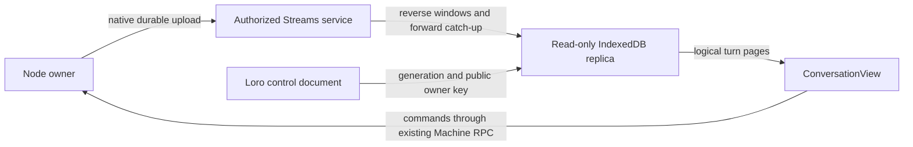

# Roost conversation delivery boundary

Status: proposed
Type: architecture
Translation: current

[中文](2026-09-30-roost-transition-delivery-lifecycle.zh.md)

## Abstract

Lody now uses the Lody-owned session backend boundary for both history implementations. New sessions select Roost, while sessions without a persisted discriminator remain pinned to Loro for compatibility. Queue promotion, steer reconciliation, history reads, assistant writes, renderer composition, and backend lifecycle all resolve through the stored session choice. Roost-specific storage and projection stay behind the adapter; callers consume the same logical history contract. Whole-history directory leases, target-aware restoration and a durable renderer read projection now cover the identified user-visible gaps. A synthetic benchmark measured a 7.8x faster latest-window read at 10,000 turns, with higher short-history startup and paging costs; complete product UX equivalence remains unverified.

## Decision and scope

The product boundary is active without a history migration. Existing sessions without a discriminator continue to use Loro, and new sessions write `historyBackend: 'roost'` before accepting their first turn. The backend choice is immutable for an opened session and is resolved from persisted metadata after restart. Every later history, queue, steer, and assistant-output operation resolves the bound backend; call sites do not branch on Roost versus Loro.

The transition must preserve the current product contract:

- A queued message is processed once, even when promotion is retried or observed on more than one replica.
- A steer is either applied to the intended running turn, transferred to an ordinary follow-up when delivery is proven impossible, or retained as an explicitly uncertain/terminal result. It is never silently replayed after unknown delivery.
- Streaming assistant output, usage, permissions, attachments, and tool items remain attached to the logical assistant message that produced them, including output arriving during finalization.
- Editing and resending an existing message creates a replacement active branch while retaining the old sealed branch. It is the only operation that intentionally replaces a logical turn. A late ACP event does not fork the conversation.
- The UI continues to render the existing `SessionHistoryInput` shape and current status vocabulary. Backend choice, physical Roost segments, recovery records, and operation identifiers are internal.

This proposal does not migrate old Loro history, change the Loro upstream library, change the Roost Rust core, or introduce a second user-visible conversation model. It covers the Lody CLI/session execution path and the shared session-facing APIs used by its clients. Platform-specific clients consume the same contracts; they do not implement a separate queue or steer protocol.

The product boundary is wired at both sides of the session: the CLI binds one backend instance to each opened document and releases it with the document, while the renderer composes `SessionData` from the persisted discriminator. The CLI composes the Loro history surface only for a Loro selection; a Roost session keeps the Loro control plane but lets the adapter own history storage. Session creation writes metadata before the first document or history write, so backend selection cannot be inferred from a partially-created conversation.

## The four transition boundaries

### `HistoryEngine`

`HistoryEngine` owns logical conversation operations. It creates and reads user turns, starts and finalizes assistant targets, applies user status changes, performs Edit & Resend, and exposes the projected history consumed by the UI and dispatch watcher. It does not expose Loro containers or Roost segments to callers.

The Loro implementation delegates to `SessionDocument`, `HistoryWriter`, the existing activation metadata, and the current history reader. It must keep the existing last-copy identity lookup and replacement-turn behavior. The Roost implementation will append or seal Roost records and use the adapter's projection to return the same logical history. The public result of an operation includes a stable logical identifier and an idempotent outcome such as `applied`, `already-applied`, `not-ready`, or `conflict`; it does not expose a storage-specific cursor.

### `DeliveryLedger`

`DeliveryLedger` owns durable intent and delivery state for queue and steer operations. It gives every user input a stable `userTurnId` and every mutation attempt an `operationId`. A retry uses the same identifiers and therefore asks the backend to complete or report the same operation instead of appending a second turn.

The ledger is deliberately separate from provider delivery. A history write proves that a logical turn exists; it does not prove that an ACP steer reached the provider. Provider results remain `applied`, `not-applied`, or `unknown`, and the existing user-facing dispositions remain derived from those results and the history evidence.

### `AssistantTargetResolver`

`AssistantTargetResolver` binds an ACP run to the logical assistant entry that owns its output. The binding is captured when the run starts and is carried on every buffered notification. Flush code never discovers its target by reading whichever turn is active at flush time. This is the boundary that prevents an old run's tail from being written into a newer user turn.

The resolver also owns the finalization tail: a target remains addressable after `finish-assistant` so late output, usage, permission results, attachments, and tool events can finish against the same logical assistant message. A subsequent turn takes ownership only when its own run is initialized.

### `HistoryProjection`

`HistoryProjection` converts backend records into the existing logical history model. Loro can project directly from its mutable assistant entry. Roost may have a sealed primary segment followed by late-output segments, so its projection groups records by `businessId` and returns one logical assistant entry in the same order as Loro. Projection is an adapter concern; callers must not inspect physical segment IDs.

The projection is incremental. A read of a visible window must not rebuild the entire long conversation merely because one assistant segment changed. The adapter may cache the business-ID grouping and invalidate only affected logical entries.

## Backend selection and ownership

The session record stores a backend discriminator at creation. Legacy sessions without that field are interpreted as `loro`. Lody binds one backend object to each opened `SessionDocument`, and all callers resolving that document receive the same object. A restart creates a new in-memory object after re-reading the persisted discriminator; a change of kind on an already-open document fails closed.

The selection rules are:

| Session                                                  | Backend before Roost launch  | Backend after Roost launch                                                    |
| -------------------------------------------------------- | ---------------------------- | ----------------------------------------------------------------------------- |
| Existing Loro session                                    | Loro                         | Loro                                                                          |
| New session                                              | Loro                         | Roost                                                                         |
| A session created during a failed backend initialization | No partially-created session | No silent mixed backend; creation reports a normal failure and may be retried |

There is no per-message fallback from Roost to Loro. Such a fallback would split one logical conversation across two histories and make queue, steer, and late-output recovery ambiguous. A backend migration, if ever needed, is a separate operation with an explicit snapshot and verification protocol.

## Queue promotion

### Existing behavior to preserve

The dispatch watcher checks turn sources in this order: local history, the durable message queue, then the RPC stash. Queue promotion is serialized by the existing rewrite-conflict lease and dispatch checks are coalesced per session. The watcher already protects against duplicate copies, settled turns, refused steers, and a missing activation pointer. Those protections remain product rules, not Loro-specific implementation details.

### Loro implementation

The Loro backend exposes one logical operation, `promoteQueuedTurn`. Its input contains the queue row identity, the stable `userTurnId`, and the `operationId`, together with the normalized turn payload. The watcher supplies the history copy it already read; a direct backend caller falls back to one targeted `readTurn`, never a second full-history materialization. The existing rewrite-conflict lease serializes the operation with Edit & Resend. The operation advances a recoverable receipt around these writes:

1. Read the queue row and the last logical history copy for `userTurnId`.
2. Record `prepared`, append the user turn when no exact copy exists, and record `history_accepted`.
3. Publish the activation pointer and record `activation_published`.
4. Remove the exact queue row and record `queue_consumed`.
5. Return the logical turn that dispatch should execute. Settled/refused-steer decisions remain in the watcher because they depend on execution-owned evidence.

The operation is idempotent. Repeating the same `operationId` after a completed phase returns the recorded logical turn without appending history. A retry after any individual write failure re-reads the ledger and only the exact turn needed to complete the missing phase. Startup reconciliation scans incomplete receipts, preserves queue order and editing leases, and closes receipts whose queue row is already gone but whose user turn was accepted. The legacy fallback identifier `queue:${$cid}` is used only when an old queue row lacks `operationId`; new writes persist the stable identifier.

The Loro command must retain the existing last-copy-wins lookup. It must not delete duplicate historical copies merely to make promotion easier. A no-op status write, a settled terminal status, an active execution owner, or an existing activation pointer can independently prove that the queue row no longer needs promotion.

### Roost implementation

Roost cannot assume one atomic transaction covers Roost history, the Loro control-plane activation pointer, and the queue row. The Roost adapter therefore records the same `operationId` and advances a small recoverable operation state in the delivery ledger. The durable phases are `prepared`, `history-accepted`, `activation-published`, and `queue-consumed`; the terminal result is `applied` or `already-applied`.

Recovery scans incomplete operations before normal dispatch. If history was accepted but activation was not published, it publishes activation using the recorded logical turn. If activation was published but queue consumption was not recorded, it removes the exact row and closes the operation. If neither durable phase is present, the queue row remains eligible. No phase causes a second Roost acceptance because acceptance is keyed by `operationId` and `userTurnId`.

The user sees the same behavior as the Loro path. The recovery record is not a second message and is never projected into conversation history.

### Queue failure matrix

| Failure point                | Loro result                                                 | Roost adapter result                                     | User-visible result    |
| ---------------------------- | ----------------------------------------------------------- | -------------------------------------------------------- | ---------------------- |
| Before history acceptance    | `prepared` receipt remains; queue row remains               | `prepared` operation remains recoverable                 | Message stays queued   |
| After history acceptance     | Resume from `history_accepted`                              | Resume from `history-accepted`                           | One ordinary turn      |
| After activation publication | Resume from `activation_published` and consume exact row    | Resume from `activation-published` and consume exact row | One ordinary turn      |
| Retry after commit           | Recorded idempotent result                                  | Operation ledger returns `already-applied`               | No duplicate turn      |
| Concurrent promotion         | Rewrite lease plus identity checks select one logical owner | Operation identity and recovery select one owner         | No duplicate execution |

## Steer lifecycle

### Existing state machine

Steer is a delivery protocol, not just a history append. The existing `steerMutationQueue` serializes ownership changes per session, while `steerStatusQueue` serializes status projection and reconciliation. The rewrite-conflict lease protects Edit & Resend and other history replacement operations. The expected turn ID is checked before provider submission and again at handoff boundaries.

The exact statuses remain:

- `pending_apply`: the user input has been recorded but has not yet been accepted by the running turn;
- `processing`: the daemon owns the steer handoff and is waiting for provider evidence;
- `handled`: provider application and local history projection completed;
- `canceled`: the exact input was canceled and must not be replayed;
- `delivery_unknown`: the provider outcome cannot prove whether the input was accepted.

The response dispositions (`applied`, `no-active-turn`, `stale-turn`, `busy`, `unsupported`, `delivery-unknown`, `promotion-failed`, and ordinary error paths) remain mapped from this state machine. A provider refusal that is proven to happen before submission may be requeued as an ordinary follow-up. A timeout, missing result, or transport ambiguity never authorizes an automatic resend.

### Loro implementation

The Loro backend keeps the existing user history row and `steerTurnStatuses` metadata. It also persists a bounded steer operation ledger keyed by a stable operation ID. It exposes backend methods for:

- recording a steer intent with its `userTurnId` and `operationId`;
- recording a provider delivery result for that exact identity;
- applying the status projection to the matching history row;
- reading history evidence for reconciliation;
- clearing the status only after the row is terminal or has been handed to ordinary execution.

`reconcileSteerHistory` calls the backend methods rather than directly calling `sessionDoc.sessionData.history.readTurn`. The current ordering remains significant: settled history evidence is checked before a refused/pending steer is held or requeued; recovery writes its operation record before clearing the steer status. A cancellation that wins while the history document is opening writes this control-plane record without waiting for the document; reconciliation later projects it through the bound backend. If the exact history row has already crossed the requeue fence, the compact status mirror is removed rather than resurrecting the input.

The Loro implementation may keep the status mirror in session metadata because that is already the durable control plane. The abstraction prevents callers from depending on that representation.

### Roost implementation

The Roost backend must persist steer identity, input, expected target, delivery kind, and status durably enough to recover after process restart. The representation is intentionally open: Roost message metadata, a dispatch-intent extension, or an adapter-owned record can satisfy the contract. A new top-level Roost `steer_intent` message kind is not required by this proposal.

The Loro control plane may continue to carry a compact status mirror for wakeups and existing clients. The mirror is advisory for dispatch; the Roost ledger is the source of truth for delivery identity and replay safety. Reconciliation imports terminal evidence into the ordinary logical history projection and removes only the exact pending identity.

### Steer failure rules

The following rules are mandatory in both backends:

- A steer can settle only the exact `userTurnId` it names.
- An `unknown` result remains unknown until later provider or history evidence resolves it; it is never converted to a safe-to-retry result merely because the local process stopped waiting.
- Stop may promote only a steer proven `not-applied` under the existing cancellation policy.
- A successor turn may take ownership only after the previous run's handoff decision is serialized through `steerMutationQueue`.
- A rewrite conflict returns `busy` and leaves the steer pending; it does not promote the input as a normal turn while Edit & Resend owns the session.

## MessageHandler and ACP output

### Target creation and correlation

At the beginning of an ACP run, MessageHandler creates an assistant target containing the logical `userTurnId`, `assistantEntryId`, `turnId`, and a monotonic local `turnEpoch`. It also creates an ACP run token. If a provider exposes a run identity, the token incorporates it; otherwise AgentClient generates the token locally and keeps it for the complete provider invocation. Each buffered notification receives its own stable operation ID. A retry after a backend partially commits a batch reuses the same IDs, and backend implementations must not apply an accepted ID twice. Filtering and batch splitting preserve ID alignment; separately enqueued notifications remain distinct.

Every ACP notification is stamped with that target before it enters `acpUpdateBuffer`. The stamp travels through batching, retry, finalization, and shutdown. A flush does not call `getCurrentACPUpdateTarget` to rebind old events to the current turn. This is required even when the provider sends sparse updates or sends callbacks after prompt completion.

The target lifecycle is:

1. `begin`: create or claim the logical assistant entry and bind the ACP run.
2. `append`: batch text, thoughts, tool items, attachments, permission results, runtime configuration, and usage against the stamped target.
3. `finalize`: wait for the history gate, drain bounded flush rounds, mark the target finished, and retain a late-output target.
4. `late-append`: accept output from the same run against the retained target, with at-least-once retry and per-notification progress.
5. `retire`: discard the target only after session deletion has quiesced timers and in-flight flushes.

The existing distinction between clearing a turn and deleting a session remains. Clearing a turn must preserve buffered ACP updates and in-flight flushes. Deleting a session must first stop new notifications, drain or record failures, and then remove all target state.

### Loro implementation

The Loro backend writes ACP output into the existing mutable assistant entry. Finalization sets its terminal fields through the existing history action. Late output updates the same entry, so the UI sees one assistant message. The current batching window, bounded retry rounds, target-local grouping, unread marker, usage flush, permission wait, and attachment/tool binding remain unchanged in meaning.

The adapter boundary is placed around `appendACPUpdatesToAssistantEntry`, `finish-assistant`, usage persistence, and rich-content persistence. MessageHandler owns event ordering and target identity; the backend owns how a logical target is represented.

### Roost implementation

Roost writes ordinary streaming output to a primary segment for the logical assistant `businessId`. Finalization seals that segment. Output arriving after sealing is appended to a later segment with the same `businessId` and a new `segmentId`. `HistoryProjection` merges those segments into one logical assistant entry, preserving event order and terminal metadata.

Late output must not call `forkAndActivate`. `forkAndActivate` remains reserved for Edit & Resend, where the user intentionally creates a replacement active branch. Applying it to every late callback would create user-visible branch churn, complicate activation, and make provider timing visible in history.

Usage, permission results, attachments, and tool items carry the same `businessId` and ACP run token. If a late item has no matching target, it is retained in the existing bounded retry/error path and never attached to the newest active turn by guesswork.

Roost's current physical `businessId`/`segmentId` representation is compatible with this plan, but an adapter or projection layer is still required because a raw active-branch read can expose physical segments rather than one logical assistant entry.

### MessageHandler failure matrix

| Failure point                             | Required behavior                                                                                       |
| ----------------------------------------- | ------------------------------------------------------------------------------------------------------- |
| Notification before user history is local | History gate delays the write; notification remains buffered with its target                            |
| Prompt returns while provider still emits | Finalization retains the target; late notifications update that target                                  |
| Flush partially persists a batch          | Per-notification progress requeues only unwritten items; persisted prefixes are not duplicated          |
| Flush fails repeatedly                    | Bounded automatic retries stop; buffered items remain for a later explicit or lifecycle-triggered drain |
| New turn starts during old tail           | New run gets a new token; old events remain bound to the old target                                     |
| Session deletion races a callback         | Deletion boundary rejects new updates, waits for in-flight work, then removes target state              |

## Edit & Resend and sealed turns

The sealed-turn constraint is already addressed at the Roost operation level: editing an existing message retains the sealed old turn and creates a replacement turn, then atomically switches the active branch with `forkAndActivate`. The transition boundary must expose this as `HistoryEngine.editAndResend`; callers do not mutate a sealed turn and do not need to know whether the replacement is a Loro copy or a Roost fork.

Queue and steer operations must respect the rewrite-conflict lease while Edit & Resend is in progress. A concurrent steer returns `busy` and stays pending. A queue promotion observes the lease and does not claim the input as a normal turn. Once the replacement branch is active, ordinary dispatch reads the new active logical history. Old sealed content remains available for branch/history inspection but is not duplicated into the active conversation.

This boundary is why late ACP output is a separate operation: a provider callback is evidence for an already-owned assistant target, not an edit request.

## Performance and user-visible behavior

The transition adds an interface call and stable identifiers to each operation. It must not add a second full-history scan to the hot path. Queue promotion and steer reconciliation read only the identities and rows needed for the exact operation; assistant streaming continues to batch target-local updates. The Loro backend keeps the current document write model, so the abstraction itself does not solve the known long-conversation LoroDoc cost. The practical performance gain comes when new sessions use Roost, while old sessions remain behaviorally compatible on Loro.

The Roost projection must be incremental and bounded. It should cache the mapping from `businessId` to logical assistant entry, invalidate only changed IDs, and avoid materializing all old segments for every token batch. Any projection cost is internal; users should see the same streaming cadence, queue status, steer result, edit result, and message ordering.

Instrumentation should record backend-independent operation timings and outcome counts: queue promotion latency and retries, steer status transitions, target flush latency and buffered bytes, projection work, and recovery phases. Logs may include opaque IDs and phase names but must not include prompt or assistant content by default.

## Implementation sequence

### Phase 1: Loro-only transition API

- Define the four boundaries and result types in the Lody session layer.
- Implement them over the existing Loro `SessionDocument`, history commands, metadata, and transient target state.
- Move queue promotion, steer reconciliation, assistant lifecycle, and history reads behind those interfaces.
- Keep the current UI protocol and status/disposition vocabulary unchanged.
- Add the session backend discriminator with legacy default `loro`.

Phase 1 is implemented in the current Lody branch. The contract now includes history reads and commands, queue promotion receipts, steer operation records, fork snapshots, lifecycle initialization/disposal, synchronization, and stable turn-order metadata. The renderer has a matching `SessionData` factory seam, the CLI avoids composing Loro history for a Roost selection, and every new-session creation path writes the discriminator before accepting the first turn.

### Phase 2: contract and failure tests

The Lody-side preparation is complete for starting the adapter:

- `apps/cli/tests/session-backend-contract.ts` defines one reusable queue contract. It runs against an injected command harness and real `LoroRepo`/`LoroDoc` storage, injecting failure after every durable receipt, history acceptance, activation publication, and queue consumption. It checks the logical turn, remaining queue rows, activation, and final receipt.
- Focused tests cover settled/refused/unknown steer results, Stop during handoff, Edit & Resend conflicts, dispatch recovery, forked-replica duplicate turn copies, late ACP output, partial batch retry, and session deletion. ACP operation IDs remain aligned through invalid-input filtering and history compaction, and remain unchanged when a partially applied batch is retried.
- Backend selection and document lifecycle tests cover legacy Loro defaulting, one backend per opened document, explicit selection before initialization, closed failure when no factory exists, and renderer factory composition. Production history accesses are routed through the backend; the remaining raw access is confined to the Loro implementation and the guarded data-only ACP fixture fallback.

The queue contract runs through the same backend boundary for Loro and Roost. The
product adapter owns Roost record placement and branch projection; performance
comparison remains a separate measurement activity.

### Phase 3: Roost adapter in production

- Implement Roost history acceptance, durable delivery operation records, assistant segment projection, and recovery behind the same contracts.
- Validate `businessId` grouping, sealed primary plus late segments, restart recovery at every queue phase, and idempotent steer settlement.
- Bind the Node owner and renderer bridge through the production factory.
- New sessions use Roost; legacy sessions without a discriminator remain pinned to Loro.
- Treat missing runtime artifacts, owner startup failure, and unsupported backend operations as explicit failures. There is no per-message fallback to Loro.

## Verification plan

The minimum acceptance suite has four layers:

1. Pure state-machine tests for queue and steer identity, status transitions, retry classification, and operation idempotence.
2. Real Loro integration tests using `SessionDocument`, `HistoryWriter`, metadata, and forked replicas. These verify that the abstraction preserves last-copy lookup, activation semantics, duplicate-copy safeguards, and the persisted steer ledger.
3. MessageHandler lifecycle tests with a fake ACP provider that emits output before history sync, after prompt completion, during a new turn, after partial persistence, and during deletion. Assertions use logical assistant IDs and content order.
4. Backend contract tests run unchanged against Loro and Roost adapters. Roost-specific crash injection covers each cross-store phase; Loro-specific tests cover the receipt phases, targeted retry reads, activation repair, and queue-order preservation.

Performance numbers remain a separate verification concern. The checked-in Roost 0.1.1 API is the product binding used by the adapter; runtime artifact availability and the local owner lifecycle are build and startup requirements, not alternate backends.

## Open points that require evidence

The original adapter questions are now classified in the product boundary
below. The shipped product supports both the desktop local owner and remote/web
renderers; the transport changes with the target machine plane, while backend
choice remains fixed by session metadata.

## Product adapter boundary (2026-10-02)

### Roost 0.1.1 product binding (2026-10-03)

The Lody checkout binds the Roost 0.1.1 API used by the product adapter. The
current workspace resolves that package from the sibling Roost checkout because
the registry publication is still pending; the adapter code and runtime
contract are the product surface. The owner binary and Node client are staged
into the Electron product resources during every build. A selected Roost
session fails explicitly when that runtime artifact is missing; it never falls
back to Loro.

### Product adapter implementation (2026-10-03)

`packages/shared/src/session-data/roost.ts` defines the storage-neutral
`RoostHistoryPort`, collapses physical segments by `businessId`, and implements
the existing `SessionHistoryReader` shape. The projection preserves display
order, appends list fields from successor segments, and forwards logical change
IDs to the renderer. Malformed role and timestamp rows are rejected before they
enter the conversation view.

`apps/cli/src/session/roost-node-session.ts` binds that port to the Roost 0.1.1
Node owner. It recovers pending batches, reads the active branch, accepts and
appends streaming turns, seals segments, records permission responses, performs
Edit & Resend through `forkAndActivate`, restores a branch for rollback, and
publishes the Roost event cursor through the Loro control document. The
`RoostSessionBackend` owns the common Lody contract; callers never inspect a
physical segment ID.

The renderer uses the local-control history bridge and the same logical reader.
Queue rows, activation, steer records, runtime configuration, and session
metadata remain in the Loro control plane. The two stores are coordinated by
operation IDs and explicit recovery phases; a successful history write is never
treated as proof that a control-plane queue row was consumed.

### SessionBackend adapter boundary (2026-10-03)

`apps/cli/src/session/roost-session-backend.ts` is the production adapter. It
delegates logical history, commands, snapshots, assistant writer callbacks, and
plan writes to Roost services, while keeping queue rows, activation, steer
ledgers, runtime configuration, and control-doc sync on the existing
`SessionDocument`. Queue promotion uses the same durable phase sequence as
Loro and accepts a Roost history write only through the backend's operation
identity.

The adapter exposes `createRoostSessionBackendFactory`, and the CLI host
registers the Node owner before any session document resolves its backend. The
owner identity, database path, history commands, writer callbacks, snapshot
semantics, and sync behavior remain explicit host responsibilities.

### Local Node wiring (2026-10-03)

The `@loro-dev/roost@0.1.1` package is bound by
`apps/cli/src/session/roost-node-session.ts`. `Lody.create()` installs the
factory before any session document resolves its backend. A session whose
metadata explicitly says `historyBackend: 'roost'` opens one shared local
`RoostNodeClient` owner, recovers pending batches, projects physical messages
into logical turns, and routes ordinary user/assistant, permission, plan, and
seen writes through the adapter. Queue rows, activation, steer ledgers, and
runtime configuration still use the Loro control plane.

The owner seed is host configuration (`LODY_ROOST_SEED_HEX`); the adapter does
not derive it from a user secret. The Node client, owner binary, and database
path may be overridden with `LODY_ROOST_NODE_CLIENT`, `LODY_ROOST_NODE_OWNER`,
and `LODY_ROOST_DB_PATH`. New session creation selects Roost, while sessions
without a discriminator remain on Loro. There is no silent fallback when the
selected Roost runtime cannot start.

The desktop renderer composes Roost `SessionData` through an Electron
local-control bridge; the browser persists the owner-accepted read projection, not a second Roost writer. A browser or
remote-machine renderer uses the same logical bridge through encrypted Machine
RPC. Both paths return logical history rows and route append, replace, permission,
action, import, and snapshot commands back to the CLI's bound `SessionBackend`.
The renderer selects the transport from the target machine plane; it never uses
the presence of `window` as a proxy for Electron. Machine RPC advertises the
`sessionHistory: 1` capability, encrypts the owner-session payload and result,
and rejects a session whose metadata is owned by another machine.

The supported product path uses the Node owner and its active-branch, streaming,
permission, import, snapshot, and edit/resend operations. Local Electron history
uses session control; Web and remote history uses Machine RPC. A missing bridge,
missing capability, malformed response, or unsupported operation fails closed;
it does not create a second history or fall back to Loro. The generic renderer
editable-tail command reports `unsupported` because its backend result includes
an in-process rollback closure; the product Edit & Resend path uses the dedicated
serializable session operation and Roost `forkAndActivate`.

### Ownership that is fixed now

| Responsibility | Owner |
| --- | --- |
| Session metadata, backend discriminator, queue rows, activation pointer, runtime configuration, session status, fork-operation control, and wakeups | Lody control plane (the existing Loro session document and metadata) |
| Logical message history, physical Roost segments, segment sealing, branch view, history projection, permission responses, and history-local recovery | Roost history adapter |
| Queue/steer operation identity and recovery phases that span the two stores | `SessionBackend` delivery ledger; the record is durable and backend-owned, never an in-memory MessageHandler map |
| Provider acceptance or refusal of a steer | ACP/AgentClient; history acceptance alone is not provider delivery evidence |
| Conversation windows, MCP history, and session orchestration | Existing Lody readers and services through `SessionBackend`/`SessionData`; they never inspect segment IDs |

The ledger owner is the adapter because the same queue and steer state machine
must run for Loro and Roost, while the persistence mechanism may differ. Its
write contract must be per-operation and recoverable. The current nested Loro
metadata maps are not a sufficient Roost design until their lost-update window
is closed; a Roost adapter must not copy that race into a second store.

### The product Roost port

The adapter is written against an internal `RoostHistoryPort`, not against
`Stream`, `IndexedDbStorage`, or `NodeLodyHistory` implementation details. The
production Node owner supplies this port, and browser composition uses the
backend bridge. It covers the common operations:

- accept, append, seal, permission response, and idempotent history batches;
- active-branch read and CAS branch accept/fork-and-activate;
- projected page, lookup-by-identity, event cursor, and change subscription;
- recovery of pending batches, local flush, remote-sync status, and disposal;
- snapshot/export/import sufficient for the existing same-backend session fork.

The Roost 0.1.1 package surface is the bound product API. No Roost-specific
method is added to Lody callers merely because it exists on an implementation
branch; all callers use the port and logical history contract.

### Logical history contract

The adapter exposes a virtual logical history. `count`, `readAt`,
`readRange`, `readDirectory`, `readTurn`, `readTurnOutput`, and `observe` all
operate on active logical turns in display order. A Roost segment is never a
row in this contract. Loro's one-list-row-per-turn layout remains compatible
with the contract but is not a reason for callers to depend on raw storage
slots or container positions.

The projection groups all message segments with the same `businessId`, keeps
their event order, and merges their content and terminal fields. A primary
assistant segment is open while streaming and is sealed at finalization. A
late callback creates a deterministic successor segment for the same
`businessId`; it does not activate a branch and does not create a second UI
message. Fields that must change after a segment is sealed use a successor
state segment or an equivalent adapter-owned record. The adapter never edits a
sealed Turn in place.

`observe` must provide the same gap-free initial directory plus exact changed
IDs that the existing renderer expects. The implementation may use Roost's
event cursor and message view, but it must not rebuild the whole conversation
for every token batch. The logical position rule is part of the product adapter
contract.

### Cross-store operations

Queue promotion keeps the existing durable phases: `prepared`,
`history-accepted`, `activation-published`, and `queue-consumed`. The Roost
history acceptance and Loro activation/queue writes are separate commits. A
retry resumes from the recorded phase and uses the same `operationId` and
`userTurnId`; it never treats a successful Roost write as proof that the
queue row was consumed.

Steer keeps the current identity and outcome rules. The stamped
`userTurnId`/ACP target follows the notification through every asynchronous
flush. A provider `unknown` result remains unknown, Stop cannot be bypassed by
an awaited backend write, and a late output callback is attached to its old
target. Reconciliation consults the adapter's exact history evidence and its
delivery ledger rather than guessing from the newest active turn.

Edit & Resend is the only logical replacement. It uses Roost
`forkAndActivate` with a revision/head CAS, then performs the required Lody
control-plane update through a recoverable operation. Queue and steer observe
the rewrite lease and return `busy` while the replacement is being committed.
Forks are same-backend only; a Roost snapshot cannot be imported into a Loro
session or the reverse.

### Lifecycle and synchronization

Opening a Roost session composes the Loro control mirror but does not create a
Loro history list, history writer, or `agentWrites`. The renderer obtains the
complete backend-neutral `SessionData` surface through the local-control bridge;
the CLI obtains the matching `SessionBackend` bound to the Node Roost owner. Any
remaining raw `sessionDoc.sessionData` access must stay inside the Loro
implementation; the auto-read hook, model-summary hook, all-history
subscription, and disposal path must be expressed as backend-neutral
capabilities or skipped explicitly for a Roost session.

`flushLocalWrites` means that local durable writes in both planes have
committed. `waitUntilSynced` is a bounded confirmation barrier for the selected
history backend and the Lody control plane; it must not report a local Roost
commit as a server acknowledgement. The adapter records separate local and
remote states for recovery and diagnostics, even though the existing caller
continues to receive one boolean result.

### Product operating boundaries

1. Every new product session uses the Roost Node owner for message history and
   the existing Loro document for control-plane metadata and delivery state.
   Desktop local sessions reach the owner through Electron session control;
   Web and remote sessions reach it through encrypted Machine RPC.
2. The Roost owner binary and client are required packaged resources. Build
   staging and `afterPack` validation fail if either is absent.
3. `flushLocalWrites` means local Roost SQLite and Loro control writes are
   durable. `waitUntilSynced` additionally waits for the Loro control sync
   barrier; it does not mean that Roost history was acknowledged by a remote
   Roost service. Remote renderer reads and writes are request/response Machine
   RPCs to the owning CLI, not a second Roost browser store.
4. Existing sessions without `historyBackend` remain on Loro. There is no
   migration or per-message fallback.

The current code selects Roost for new sessions and keeps legacy sessions
pinned to Loro. CLI callers may explicitly request either backend with
`session create --history-backend <kind>`; the persisted session discriminator
wins for an already-open session.

### Bound integration API

The product integration uses the local `@loro-dev/roost@0.1.1` checkout, including
the active-branch page API, on the owning CLI. Publication is not verified here. The browser does not depend on Roost's Node or storage modules. Its
history capability is negotiated as Machine protocol `sessionHistory: 1`; older
daemons fail with an explicit capability error before an unknown RPC method is
sent. The RPC content and result use the existing owner-session AES-GCM envelope,
and the machine validates that the session metadata belongs to itself.

Operational work includes measuring long streaming projection cost and
late-output volume, and checking published artifact packaging on each supported
platform. The user-visible parity work below is also part of this integration,
independently of those operational checks. A selected Roost session never falls back to
Loro.

### Read refresh and observation fencing

The shared Roost reader tags each projection load with an invalidation generation.
A history notification advances that generation; an older in-flight read may
finish in the background, but cannot repopulate the cache; callers waiting on it
retry against the current generation, including when the stale read fails. The
initial observation directory follows the same rule and cannot replace a cache
invalidated while its snapshot was loading.

The renderer bridge registers the history listener before reading the latest
active-branch directory page. Positions and counts belong to the same page;
structural notifications fence overlapping reads and remain queued through
bootstrap. The view retries failed reads with backoff and retains dirty changes,
including a failed initial page or body refresh.

The Node owner initializes and refreshes a 40-turn logical window through
`readActiveBranchPage({ latest: true })`. Directory pages supply a bounded body
cache, so ordinary `readDirectory`, `readRange`, and hydration do not invoke
`readActiveBranch()`. Cache misses scan reverse pages and retain only bounded
page bodies. Full reads remain for export/snapshot, complete turn-output
selection, import/edit planning, and updates that must resolve an older stored
turn's segments. A missing new identity is checked directly before considering
a full branch read. An off-window late successor remains the physical head and
must be resolved and sealed before appending its child.

### Reverse-page integration and correction (2026-10-04)

Roost commit `323fc8e` already provided `latest`/`before` reverse keyset reads,
and the isolated Lody implementation at `9d9abd01` delivered a latest window,
`loadOlder`, and live refresh retaining older rows (historical validation: 8/8).
The earlier claim that reverse reading itself was missing was incorrect. That
path preceded active-branch editing (`767decc`); generic published pages retain
superseded suffixes, so the current product reader uses active-branch ancestry.

The current local Roost API supplies that branch-aware page to the existing
SessionHistoryReader/ConversationView path. Absolute unloaded slots stay
sentinels; rendering, hydration and fact queries skip them, and fact coverage
remains incomplete until the older prefix is loaded. The viewport's actual edge
triggers `loadOlder`, independently of its larger hydration prefetch range.
Live append retains the cursor of the oldest loaded prefix. A fork or expired
cursor rebases only the loaded window; in-flight pages crossing a structural
change cannot replace the newer membership. Page metadata and continuity are
validated before merge, and the shorter final page ends at its cursor.

Roost cursors carry successor references still awaiting their primary message,
not already-consumed page segments. An older cursor checks ancestry after an
append and includes intervening late successors. Logical turn counts count
primary identities once, regardless of successor segment count. Roost's linear
branch metadata enables bounded page reads for new Lody histories; legacy or
nonlinear ancestry can still use Roost's directory compatibility path. This
is not a claim of constant-cost cold reads for arbitrary imported histories.

Validation now includes the synthetic backend benchmark below and static checks.
Product launch, packaging, test suites and release procedures have not been run;
earlier overlay tests are not treated as current acceptance evidence.

### User-visible parity work (2026-10-04)

Correction: storage wiring and reverse pagination alone did not preserve the
LoroDoc experience. Source review found incomplete search/outline/fact coverage,
unreliable restoration outside the latest window, and no durable renderer history.
These are product requirements, not optional follow-up work.

The current implementation addresses those paths:

- `ConversationView.acquireDirectory` gives full-index, search and fact consumers
  a cancellable lease on reverse pagination. The initial window stays bounded;
  directory completion no longer depends on manual scrolling. Facts derive and
  release body chunks, and search holds its existing body lease only while open.
  Failed reads retain incomplete coverage and retry while the consumer is active.
- Restoration requests the saved logical turn before accepting the first viewport
  report. The existing scroll engine retains ownership of the anchor and scroll
  position; no second scroller or hidden viewport is introduced.
- `roost-history-cache.ts` persists owner-accepted pages in IndexedDB, scoped by
  account/workspace/machine/session. Page bodies, directory and revision commit
  together. Bounded first-page reads can start from this snapshot while the
  existing local-control/Machine-RPC transport refreshes it in the background.
  Complete cached history supports offline reopening, paging, search and export.
- CLI read responses identify one locally durable history revision and carry the
  requested page's logical bodies. Reads straddle local write barriers and retry
  if the revision moves. Consecutive content changes refresh only changed turns;
  a covered structural suffix updates atomically. A revision gap stages bounded
  reverse pages in a second cache slot, keeping the last coherent snapshot until
  the replacement is complete. Older reads cannot overwrite a newer checkpoint.
- The read cache never accepts commands, replays provider delivery, or becomes a
  Loro fallback. It is released with its SessionData and included in Clear Cache.
  Cache failures do not change history ownership; unsynchronized history still
  requires its owner. A gap interrupted by disconnection keeps the last coherent
  snapshot, not a mixture of old and new branches.

These implementation paths have static verification, and the backend/view path
has the benchmark evidence below. Product UX equivalence, offline reconnect and
frame times have not been measured.

### Benchmark and verification (2026-10-04)

The later benchmark request explicitly permits performance runs. The owning
runner is `apps/cli/benchmarks/roost-history.mts`: synthetic 100/1,000/10,000-turn
linear histories with 4 KiB text bodies, a release SQLite owner, real Lody backends
and the shared ConversationView. It alternates Loro/Roost samples and separates
snapshot import, backend open, latest-window hydration, older-page hydration and
streaming delivery. No production profile or release is involved. The run used
Node v26.8.2 on Linux arm64 with a warm OS page cache; each sample created a fresh
backend/view. Loro updates exclude disk flush; Roost writes include SQLite
durability. Results and measurement limits follow.

Runtime blockers found during the benchmark: Roost's branch envelope fields were
read under an incorrect `content` prefix, and a 40-row page exceeded the Node
client's 32-request limit. These are corrected in the Roost checkout. Lody's
streaming batch also reused the before-image's mutable item arrays; the shared
applier changed both sides of the diff, causing the adapter to skip persistence.
The adapter must apply to a detached working copy before comparing and writing.

The optimized run (seven samples after two warmups) measured the following medians
in milliseconds. `Readable` includes Loro snapshot import and Roost owner/backend
open; Roost uses a real release SQLite owner while Loro uses an in-memory Repo.
`Older` loads the preceding 40 logical turns and `Stream` appends ten small updates
to the visible unsealed assistant. The Roost latest-page path performed one 40-row
page read and zero full-branch reads at every size.

| Logical turns | Loro readable | Roost readable | Loro older | Roost older | Loro stream | Roost stream |
| ---: | ---: | ---: | ---: | ---: | ---: | ---: |
| 100 | 8.20 | 43.47 | 0.29 | 31.18 | 0.19 | 3.90 |
| 1,000 | 68.85 | 61.82 | 0.29 | 35.39 | 0.16 | 4.30 |
| 10,000 | 795.21 | 101.53 | 0.36 | 41.96 | 0.16 | 4.50 |

At 10,000 turns, the bounded Roost path is about 7.8x faster to a readable latest
window; its view-only hydration is 3.01 ms versus Loro's 74.26 ms after import.
Small histories still pay the owner/SQLite startup cost, and older-page reads are
slower because Loro already holds the complete snapshot. The 10,000-turn Roost
readable P95 was 435.43 ms with variation in owner startup, so this is a data-path result,
not a product cold-start or frame-time guarantee. Renderer transport, IndexedDB,
React paint, full search, fact derivation and offline refresh were not measured.

The first run found four latest-page reads at open, repeated 40-turn reads per
content update, and a mutable before-image bug in the streaming applier. The final
change limits an in-window, unsealed primary refresh to its already-proven physical
identity, updates its logical projection and invalidates stale reads, and publishes
through the existing durable cursor. Structural edits retain active-branch paging;
new observations reuse the owner-held coherent latest window.

The follow-up fence checks both branch identity and read generation before
installing a partial refresh. External cursor refreshes join the local write queue
so an older branch read cannot overwrite a newer mutation; disposal also rejects
pending refreshes. Benchmark subscriptions declare cleanup before callbacks use
it. The table records the completed seven-sample run before these final guards.
After the guards, a 100-turn single-sample smoke run completed opening, older-page
hydration and ten visible streaming updates for both backends. CLI and benchmark
type checks and scoped formatting passed again; the smoke timings do not replace
the warmed measurements above. This run does not exercise concurrent branch rewrites.

- Roost TypeScript build and Lody CLI `tsc --noEmit`: passed.
- Oxfmt on the changed paging/bridge code and `git diff --check` in both repositories: passed.
- `node scripts/docs/main.mjs check`: passed after moving the Node paging explanation
  to its module README and keeping the scoped AGENTS file under its size limit.
- Components `tsc --noEmit`: blocked by existing missing `papaparse`,
  `@extend-ai/react-docx`, `@extend-ai/react-pptx`, `@extend-ai/react-xlsx`, and `fflate`
  dependencies (including their dependent implicit-any errors). No paging-file errors.
- The benchmark runner type-check passed with the CLI configuration; the final run
  used `BENCH_SIZES=100,1000,10000`, two warmups, seven samples, 4 KiB synthetic
  bodies, and the release owner. Roost `cargo fmt --check`, `cargo clippy --locked
  --all-targets -- -D warnings`, and TypeScript build also passed.
- Tests and release procedures were excluded by the user and were not run. Local
  commits are recorded in the following checkpoint; no push was performed.
- The parity changes passed CLI TypeScript, scoped formatting, documentation and
  public/platform boundary checks. Components type checking reports only the
  pre-existing office/CSV dependency failures listed above. The new cache and
  consumer paths have not undergone runtime acceptance.

## 2026-10-05 local commit checkpoint

The user authorized local commits in both repositories on
`feat/roost-history-integration`. Lody's base is `91c0bb14`; its local
`file:../../../roost/ts` dependency corresponds to Roost commit `8b682ef`
(`@loro-dev/roost` 0.1.1, with the Rust package unchanged at 0.1.0).
The integration commit includes the CLI owner/backend, history transport, renderer
paging and cache, Electron artifact packaging, shared contracts, benchmark runner
and the existing integration test sources.

Pre-commit cleanup removed unused type imports, distinguished shadowed locals and
made the existing async-loop exit guards explicit. The CLI type check, changed-file
type-aware lint, formatting, public/platform boundary, Code Collab import and i18n
checks passed. These checks do not replace the runtime acceptance limits above.
Components type checking remains blocked by the existing missing dependencies.

The lockfile now records the local Roost directory and its complete dependency
subtree. Its importer and package/snapshot entries were checked against a minimal
pnpm-generated resolution using the real package manifests. Full offline workspace
resolution stopped at the unrelated cached `@openai/codex@^0.159.2` metadata;
unrelated dependency records were retained. Test suites, release and publishing
procedures remain excluded, and neither repository was pushed.

## Remote history synchronization: current work

The local-owner/RPC boundary above was the committed starting point. Remote
history must also remain readable from the durable service when the owning CLI
is offline, including pages never cached by that reader. This revision connects
that path and replaces the former unconditional Node sync result with actual
upload confirmation. Local writes, RPC responses and remote persistence remain
distinct events.

Execution plan, owned by this note:

1. Reuse Roost's existing Node `registerRemote` / `stream.sync` and browser sync
   APIs. Inspect the actual Streams SDK and the SQLite Riverrun implementation
   it uses for development; do not create a replacement wire protocol or mock
   storage backend.
2. Bind credentials, stream identity and owner admission through the existing
   workspace/platform capabilities. Public local composition stays local;
   cloud-enabled composition obtains credentials through its existing provider.
3. Upload committed history in the background, retain persistent retry state,
   and make the history sync barrier report actual remote confirmation. Release
   work and credentials with the workspace/session lifecycle.
4. Let remote readers persist and hydrate native Roost history through bounded
   reverse windows, then resume forward reads from the tail captured by that
   window. Preserve the current logical-turn reader and normal write ownership.
5. Update the shared contracts, owning documentation and bilingual Spec as
   implementation proceeds. Run type/build/static checks; test suites, deployment
   and publishing remain excluded by the user's current instructions.

Initial evidence: `streams-client@0.8.0` implements `readBackward` and offset
resumption; its development dependency is `@loro-dev/sqlite-riverrun@0.3.0`.
Roost already exposes reverse-window fetch, prefix completion, persistent upload
and original-tail catch-up. These capabilities must be connected, not treated as
proof that the current Lody integration already uses them.

### 2026-10-05 implementation checkpoint

The workspace now binds native Node upload to the existing authorized Streams
lifetime. A native local catalog enrolls a session before its first write and
resumes uploads after restart without opening session documents. Local acceptance
only wakes the durable native uploader; the sync barrier requires a drained,
confirmed upload and still combines with the control-plane barrier. Shared control
stores only an app-generation and the public owner key, never a token or endpoint.

The renderer integration composes a native IndexedDB partial replica for cloud
history reads and retains owner RPC for commands. Initial/latest pages use the
existing logical branch projection; backward
windows keep contiguous received ranges, and catch-up starts at the original
window tail. Replica cursors never inherit the owner's event revision. Roost's
read-only history construction and synchronized branch restoration are implemented.

Checkpoint checks: Roost TS build and Lody CLI typecheck pass. Components typecheck
reports only the existing missing office/CSV/archive dependencies and their related
implicit-any errors after the adapter errors were corrected. No test suite,
benchmark, deployment or publishing has run in this revision.
Published `sqlite-riverrun@0.3.0` was inspected: it is a real local Streams
server, but that published build does not contain the backward-read extension.
Local service acceptance needs a build exposing the current Streams backward API;
this is not evidence that the deployed service is missing it.

The implemented ownership is:

### Static review corrections

- Shared browser tabs reload durable hints inside their intake lock; native
  Inbox/Replay remains transactional when Web Locks is unavailable. The first
  opener no longer overwrites another tab's initialized progress. Event cursors
  advance only after indexing succeeds. Ordinary cached body/range/directory
  reads stay synchronous while network work waits; idle polling is two seconds,
  with immediate control/write wakeups and bounded failure backoff.
- The initial window remains 40 logical turns with a 500-body cache. Network
  windows start at 256 KiB; only a single larger transport message increases the
  assembly budget, up to 64 MiB. Missing old boundaries/prefixes never become an
  empty or shortened complete history. Prefix repair is explicit and bounded per
  slice; it may still scan intervening log bytes for a distant Create.
- Limit check: Roost `MAX_BATCH` caps the complete RST1 encoding, including framing,
  at 64 MiB. The reader budgets raw batch payload bytes; transport span metadata is
  outside that payload, so the 64 MiB assembly ceiling covers the largest legal
  batch without an extra 64-byte allowance.
- Roost branch checks now capture their event CAS before reading the expected
  state. Full-branch snapshots use the durable read fence. Restore commits a
  signed non-message record so other replicas observe rollback; these are TS
  adapter changes, not Rust core or wire-format changes.
- `branch_state` is written only through `restoreActiveBranch`: writable identities,
  generic `accept`, and batch commands exclude it, with runtime rejection at the
  write entry points. Indexing still recognizes it to reconstruct remote branches.
- Verification: the Roost TS build, Lody CLI TypeScript check, Lody documentation
  check, and both repositories' `git diff --check` passed. Components still reports
  only the pre-existing missing `papaparse`, `@extend-ai/react-docx/pptx/xlsx`, and
  `fflate` packages with related implicit-any errors. No tests, benchmarks,
  deployment, publishing, commit or push were run.
- Restart enrollment precedes writes, including pending-batch recovery. Workspace
  detach aborts authorized network work; disposal drains it before releasing the
  shared owner/storage. Recoverable cache clearing includes native replica names;
  a hard reset retains the deletion manifest until the next-boot database wipe.

The control marker is an application generation, not proof that a service stream
has never been recreated. Transport uses the existing service auth/TLS with native
plaintext mode and normal seal verification; this change does not introduce or
claim payload end-to-end encryption. Both consumers still use the sibling Roost
package. No registry release or deployed-service capability is inferred from the
local source/API checks.

### 2026-10-08 feature-gate follow-up

The earlier transition decision made Roost the unconditional default for newly
created sessions. That default is superseded by the opt-in gate recorded in
[the Roost history feature-gate note](../feature/2026-10-08-roost-history-feature-gate.md):
Loro is now the shared default, and the renderer writes `historyBackend: 'roost'`
only when both Experimental features and Roost history are enabled. Persisted
session choices remain immutable, so changing the switch does not change an
existing conversation. This is a creation-policy revision; the backend
ownership, logical-history, synchronization, and lifecycle boundaries above are
unchanged.
