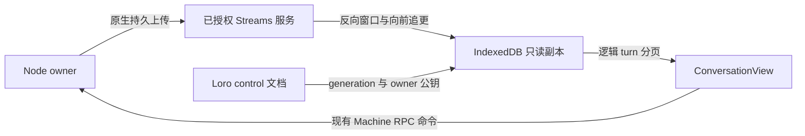

# Roost 对话投递边界

Status: proposed
Type: architecture
Translation: current

[English](2026-09-30-roost-transition-delivery-lifecycle.md)

## 摘要

Lody 现在通过自己的 session backend 边界同时承载 Loro 和 Roost 两种 history 实现。新会话选择 Roost，没有持久 discriminator 的旧会话继续固定在 Loro。queue promotion、steer reconcile、history 读取、assistant 写入、renderer composition 和 backend 生命周期都根据会话保存的选择解析；Roost 的存储与 projection 留在 adapter 内部，调用方只消费相同的逻辑 history 契约。完整 directory lease、按目标补页的阅读位置恢复及 renderer 持久读取副本现已覆盖发现的体验缺口。合成 benchmark 测得 10,000 条历史的最新窗口就绪约快 7.8 倍，但短历史启动和翻页成本更高；完整产品体验等价性仍未验收。

## 决策与范围

产品边界已经启用，但不迁移历史。没有 discriminator 的已有会话继续使用 Loro；新会话在接受首条 turn 前写入 `historyBackend: 'roost'`。打开后的会话 backend 选择不可变，重启时从持久 metadata 重新解析。之后所有 history、queue、steer 和 assistant 输出操作都通过绑定的 backend 执行，调用方不分别判断 Roost 或 Loro。

过渡必须保持现在的产品契约：

- queue 消息只处理一次，即使 promotion 被重试，或者在多个副本上被观察到。
- steer 要么应用到指定的运行中 turn，要么在明确证明无法投递时转成普通后续 turn，要么保留为明确的未知或终态；投递未知时绝不能静默重放。
- 流式 assistant 输出、usage、permission、附件和 tool item 始终绑定到产生它们的逻辑 assistant 消息，包括 finalization 期间到达的输出。
- 编辑并重新发送已有消息时创建 replacement active branch，同时保留旧 sealed branch。这是唯一有意替换逻辑 turn 的操作；晚到 ACP 事件不能创建 fork。
- UI 继续消费现有的 `SessionHistoryInput` 形状和状态词汇。backend 选择、Roost 物理 segment、恢复记录和 operation identifier 都是内部细节。

本提案不迁移旧 Loro 历史、不修改 Loro 上游库、不修改 Roost Rust core，也不引入第二种用户可见的会话模型。范围覆盖 Lody CLI/session execution 路径及其客户端使用的共享会话 API。平台客户端使用同一组契约，不各自实现 queue 或 steer 协议。

产品边界现在同时覆盖会话两端：CLI 为每个打开的文档绑定一个 backend，并在文档销毁时释放；renderer 根据持久 discriminator 组合 `SessionData`。CLI 选择 Roost 时只组合控制面，不创建 Loro history reader/writer，由 adapter 负责 history 存储。会话创建先写 metadata，再接受首个文档或 history 写入，因此 backend 选择不会从半成品会话中推断。

## 四个过渡边界

### `HistoryEngine`

`HistoryEngine` 负责逻辑会话操作：创建和读取 user turn，开始和结束 assistant target，应用 user status，执行 Edit & Resend，并提供 dispatch watcher 和 UI 消费的投影历史。它不向调用方暴露 Loro container 或 Roost segment。

Loro 实现委托给 `SessionDocument`、`HistoryWriter`、现有 activation metadata 和历史 reader，同时保留现有的 last-copy identity lookup 以及 replacement-turn 行为。Roost 实现会追加或 seal Roost 记录，并通过 adapter 的 projection 返回相同的逻辑历史。操作结果包含稳定的逻辑标识与幂等结果，例如 `applied`、`already-applied`、`not-ready` 或 `conflict`，不暴露存储特有的 cursor。

### `DeliveryLedger`

`DeliveryLedger` 负责 queue 与 steer 的持久 intent 和投递状态。每个 user input 都有稳定的 `userTurnId`，每次 mutation 都有 `operationId`。重试使用相同标识，因此 backend 会完成或报告同一个操作，而不是再次追加一个 turn。

账本与 provider 投递是有意分开的。历史写入只能证明逻辑 turn 存在，不能证明 ACP steer 已经到达 provider。provider 结果仍然是 `applied`、`not-applied` 或 `unknown`；用户可见的 disposition 继续由这些结果与历史证据共同推导。

### `AssistantTargetResolver`

`AssistantTargetResolver` 把 ACP run 绑定到拥有其输出的逻辑 assistant entry。绑定在 run 开始时捕获，并随每个 buffered notification 一起携带。flush 代码不能在 flush 时读取“当前 active 的 turn”来重新决定旧事件的 target。这是防止旧 run 的尾部输出写入新 user turn 的关键边界。

解析器还负责 finalization 尾部：`finish-assistant` 之后 target 仍然可寻址，使晚到输出、usage、permission 结果、附件和 tool event 继续写入同一逻辑 assistant 消息。只有新 turn 自己初始化 run 后，后续 turn 才能接管输出所有权。

### `HistoryProjection`

`HistoryProjection` 把 backend 记录转换为现有逻辑历史模型。Loro 可以直接从可变 assistant entry 投影；Roost 可能有一个 sealed primary segment 以及多个晚到输出 segment，因此它按 `businessId` 分组，并按与 Loro 相同的顺序返回一个逻辑 assistant entry。投影是 adapter 的职责，调用方不能检查物理 segment ID。

投影必须增量化。读取可见窗口时，不能因为一个 assistant segment 改变就重新构建整个长对话。adapter 可以缓存 `businessId` 到逻辑 entry 的分组关系，只使受影响的逻辑 entry 失效。

## Backend 选择与所有权

会话记录在创建时保存 backend discriminator。没有该字段的旧会话按 `loro` 解释。Lody 会把一个 backend 对象绑定到每个已打开的 `SessionDocument`，同一文档的所有调用都拿到这个对象。进程重启后会重新读取持久 discriminator 并创建新的内存对象；已打开文档的 backend 类型发生变化时直接 fail closed。

选择规则如下：

| 会话                         | Roost 上线前     | Roost 上线后                                           |
| ---------------------------- | ---------------- | ------------------------------------------------------ |
| 已有 Loro 会话               | Loro             | Loro                                                   |
| 新建会话                     | Loro             | Roost                                                  |
| backend 初始化失败时的新会话 | 不创建半成品会话 | 不静默切换为混合 backend；创建操作返回普通失败，可重试 |

不存在单条消息从 Roost fallback 到 Loro 的路径。那会把同一个逻辑会话拆到两个历史中，使 queue、steer 和晚到输出的恢复无法判定。未来若需要迁移 backend，应当另行定义显式 snapshot 和校验协议。

## Queue promotion

### 必须保留的现有行为

dispatch watcher 按以下顺序检查 turn 来源：本地 history、持久 message queue、RPC stash。queue promotion 由现有 rewrite-conflict lease 串行化，dispatch check 按 session 合并。watcher 已经保护重复 copy、已结算 turn、被拒绝的 steer 以及缺失 activation pointer；这些是产品规则，不是 Loro 专属细节。

### Loro 优先实现

Loro backend 暴露一个逻辑操作 `promoteQueuedTurn`。输入包含 queue row 标识、稳定的 `userTurnId`、`operationId` 和规范化后的 turn payload。watcher 会传入自己已经读取的 history copy；直接调用 backend 时最多对指定 turn 做一次 `readTurn`，不会再次物化整个 history。现有 rewrite-conflict lease 负责与 Edit & Resend 串行化，操作围绕可恢复 receipt 推进这些写入：

1. 记录 `prepared`；在不存在精确 copy 时追加 user turn，然后记录 `history_accepted`。
2. 发布 activation pointer，然后记录 `activation_published`。
3. 删除精确 queue row，然后记录 `queue_consumed`。
4. 返回 dispatch 应执行的逻辑 turn。settled/refused steer 的判断仍在 watcher 中，因为它依赖 execution-owned evidence。

操作必须幂等。完成某个阶段后重复相同 `operationId` 只返回已记录的逻辑 turn，不再次追加 history。任何单次写入失败后的重试只读取账本和指定 turn，完成缺失阶段。启动恢复会扫描未完成 receipt，保留 queue 顺序与编辑 lease；如果 queue row 已经消失但 user turn 已接受，则只修复 activation 并关闭 receipt。旧 queue row 没有 `operationId` 时使用兼容标识 `queue:${$cid}`；新写入持久化稳定标识。

Loro command 必须保留现有 last-copy-wins lookup，不为了简化 promotion 删除历史 duplicate copy。no-op status write、settled terminal status、active execution owner 或已有 activation pointer 都可以独立证明 queue row 不再需要 promotion。

### Roost 实现

Roost 不能假设一次事务同时覆盖 Roost history、Loro control-plane activation pointer 和 queue row。因此 Roost adapter 使用相同的 `operationId`，并在 delivery ledger 中推进可恢复的操作状态。持久阶段为 `prepared`、`history-accepted`、`activation-published` 和 `queue-consumed`；终态结果为 `applied` 或 `already-applied`。

正常 dispatch 前先扫描未完成操作。如果 history 已接受但 activation 尚未发布，就用记录的逻辑 turn 发布 activation；如果 activation 已发布但 queue consumption 尚未记录，就删除精确 row 并关闭操作；如果没有任何持久阶段，queue row 仍可 promotion。任何阶段都不能因重启而二次接受 Roost，因为 acceptance 以 `operationId` 和 `userTurnId` 做幂等键。

用户看到的行为与 Loro 路径相同。恢复记录不是第二条消息，也不会被投影到会话 history。

### Queue 故障矩阵

| 故障点                  | Loro 结果                                        | Roost adapter 结果                           | 用户可见结果          |
| ----------------------- | ------------------------------------------------ | -------------------------------------------- | --------------------- |
| history acceptance 之前 | `prepared` receipt 保留，queue row 保留          | 保留可恢复的 `prepared` 操作                 | 消息继续排队          |
| history acceptance 之后 | 从 `history_accepted` 继续                       | 从 `history-accepted` 继续                   | 一个普通 turn         |
| activation 发布之后     | 从 `activation_published` 继续并消费精确 row     | 从 `activation-published` 继续并消费精确 row | 一个普通 turn         |
| commit 后重试           | 返回记录的幂等结果                               | ledger 返回 `already-applied`                | 不产生 duplicate turn |
| 并发 promotion          | rewrite lease 与 identity 检查选出一个逻辑 owner | operation identity 与恢复选出一个 owner      | 不重复执行            |

## Steer 生命周期

### 必须保留的状态机

Steer 是投递协议，而不只是一次 history append。现有 `steerMutationQueue` 按 session 串行化所有权变化，`steerStatusQueue` 串行化状态投影与 reconcile。rewrite-conflict lease 保护 Edit & Resend 及其他 history replacement 操作。expected turn ID 在 provider submission 前以及 handoff 边界再次检查。

状态保持不变：

- `pending_apply`：user input 已记录，但尚未被运行中的 turn 接受；
- `processing`：daemon 正在持有 steer handoff，等待 provider evidence；
- `handled`：provider 应用和本地 history 投影都完成；
- `canceled`：精确输入已取消，不得重放；
- `delivery_unknown`：provider 结果不能证明输入是否已被接受。

response disposition（`applied`、`no-active-turn`、`stale-turn`、`busy`、`unsupported`、`delivery-unknown`、`promotion-failed` 以及普通 error 路径）继续由这套状态机映射。只有明确证明发生在提交前的 provider refusal 才能转成普通 follow-up。timeout、缺少结果或传输歧义都不能授权自动重发。

### Loro 优先实现

Loro backend 继续保存现有 user history row 和 `steerTurnStatuses` metadata，并额外按稳定 operation ID 持久化有界的 steer operation ledger。它提供以下 backend 方法：

- 用 `userTurnId` 和 `operationId` 记录 steer intent；
- 为精确标识记录 provider delivery result；
- 把 status projection 应用到匹配的 history row；
- 读取 history evidence 做 reconcile；
- 只有 row 已经 terminal 或已经交给普通执行后才清理 status。

`reconcileSteerHistory` 调用 backend 方法，而不是直接调用 `sessionDoc.sessionData.history.readTurn`。现有顺序不能改变：先检查 settled history evidence，再决定 hold 或 requeue refused/pending steer；恢复逻辑先写 operation record，再清理 steer status。若取消在 history document 打开期间获胜，会先在 control plane 写入这条记录，不等待 document；document 可用后再由绑定的 backend 做投影。若精确 history row 已经越过 requeue fence，则清理紧凑 status mirror，不重新唤醒该输入。

Loro 实现可以继续把 status mirror 放在 session metadata 中，因为这已经是持久 control plane；抽象边界保证调用方不依赖这种表示方式。

### Roost 实现

Roost backend 必须持久化 steer identity、input、expected target、delivery kind 和 status，使进程重启后可以恢复。具体表示方式保持开放：Roost message metadata、dispatch-intent 扩展或 adapter 自有记录均可满足契约。本提案不要求新增顶层 Roost `steer_intent` message kind。

Loro control plane 可以继续携带用于唤醒和兼容现有客户端的精简 status mirror。对于 dispatch，这个 mirror 只是辅助信息；投递 identity 和 replay safety 的事实来源是 Roost ledger。reconcile 把 terminal evidence 导入普通逻辑 history projection，并只删除对应的 pending identity。

### Steer 强制规则

两个 backend 都必须满足以下规则：

- steer 只能结算它命名的精确 `userTurnId`。
- `unknown` 在后续 provider 或 history evidence 解决前保持 unknown；不能仅因本地进程停止等待就把它转换成可安全重试。
- Stop 只能提升已经证明 `not-applied` 的 steer，并遵守现有取消策略。
- successor turn 只有在上一个 run 的 handoff decision 通过 `steerMutationQueue` 串行化后才能接管。
- rewrite conflict 返回 `busy` 并保留 steer pending；不能在 Edit & Resend 持有会话时把输入 promotion 成普通 turn。

## MessageHandler 与 ACP 输出

### Target 创建与关联

ACP run 开始时，MessageHandler 创建 assistant target，包含逻辑 `userTurnId`、`assistantEntryId`、`turnId` 和单调递增的本地 `turnEpoch`，同时创建 ACP run token。provider 暴露 run identity 时将其纳入 token；没有时由 AgentClient 生成 token，并在整个 provider invocation 期间保持不变。每条缓冲通知还会获得独立且稳定的 operation ID。backend 部分提交一个批次后重试时会复用原 ID，backend 不得重复应用已接受的 ID。过滤和拆分批次必须保持 ID 对应关系；分别入队的通知仍是不同事件。

每个 ACP notification 在进入 `acpUpdateBuffer` 前都带上 target。这个标记贯穿 batching、retry、finalization 和 shutdown。flush 不能通过读取 `getCurrentACPUpdateTarget` 把旧事件重新绑定到当前 turn；即使 provider 发送稀疏更新，或者在 prompt 完成后才回调，也必须如此。

Target 生命周期为：

1. `begin`：创建或接管逻辑 assistant entry，并绑定 ACP run。
2. `append`：把文本、thought、tool item、附件、permission result、runtime config 和 usage 按 stamped target 批量写入。
3. `finalize`：等待 history gate，排空有上限的 flush 轮次，标记 target 完成，并保留晚到输出 target。
4. `late-append`：同一 run 的晚到输出继续写入保留的 target，并按通知粒度进行 at-least-once retry。
5. `retire`：只有 session deletion 排空 timer 和 in-flight flush 后才丢弃 target。

清理 turn 与删除 session 仍然是两件事。清理 turn 必须保留 buffer 和 in-flight flush；删除 session 必须先停止新 notification、排空或记录失败，然后删除 target 状态。

### Loro 优先实现

Loro backend 把 ACP 输出写入现有可变 assistant entry。finalization 通过现有 history action 设置终态字段。晚到输出继续更新同一 entry，所以 UI 只看到一条 assistant 消息。现有 batching window、有上限的 retry 轮次、target-local 分组、unread marker、usage flush、permission wait 以及附件/tool 绑定在语义上保持不变。

adapter 边界放在 `appendACPUpdatesToAssistantEntry`、`finish-assistant`、usage 持久化和 rich-content 持久化周围。MessageHandler 负责事件顺序和 target identity；backend 负责逻辑 target 的物理表示。

### Roost 实现

Roost 把普通流式输出写入逻辑 assistant `businessId` 的 primary segment，并在 finalization 时 seal。seal 之后到达的输出写入同一 `businessId` 的后续 segment，使用新的 `segmentId`。`HistoryProjection` 把这些 segment 合并成一条逻辑 assistant entry，并保持事件顺序和 terminal metadata。

晚到输出不能调用 `forkAndActivate`。`forkAndActivate` 只用于 Edit & Resend，因为那是用户明确创建 replacement active branch 的操作。若每个晚到 callback 都调用它，会生成用户可见的 branch 变化，让 activation 复杂化，并把 provider timing 暴露到历史中。

usage、permission result、附件和 tool item 都携带相同的 `businessId` 与 ACP run token。没有匹配 target 的晚到 item 进入现有有界 retry/error 路径，不能猜测性地绑定到最新 active turn。

Roost 目前已有的 `businessId`/`segmentId` 物理表示与该规划兼容，但仍需要 adapter 或 projection 层，因为原始 active-branch read 可能返回物理 segment，而不是一条逻辑 assistant entry。

### MessageHandler 故障矩阵

| 故障点                            | 必须行为                                                         |
| --------------------------------- | ---------------------------------------------------------------- |
| user history 尚未在本地           | history gate 延迟写入，notification 保留在带 target 的 buffer 中 |
| prompt 返回但 provider 继续输出   | finalization 保留 target，晚到 notification 更新该 target        |
| batch 部分持久化                  | 按 notification 记录进度，只重新排队未写入项，不重复已写 prefix  |
| flush 连续失败                    | 停止自动 retry，但 buffer 保留给后续显式或生命周期 drain         |
| 旧 turn 期间新 turn 开始          | 新 run 使用新 token，旧事件仍绑定旧 target                       |
| session deletion 与 callback 竞争 | deletion 边界拒绝新更新，等待 in-flight 完成，再删除 target 状态 |

## Edit & Resend 与 sealed turn

sealed-turn 约束在 Roost 操作层已经有对应解决方案：编辑已有消息时保留 sealed 旧 turn，创建 replacement turn，然后通过 `forkAndActivate` 原子切换 active branch。过渡边界把它暴露为 `HistoryEngine.editAndResend`；调用方不能修改 sealed turn，也不需要知道 replacement 是 Loro copy 还是 Roost fork。

Edit & Resend 进行时，queue 与 steer 必须服从 rewrite-conflict lease。并发 steer 返回 `busy` 并保持 pending；queue promotion 观察到 lease 后不能把输入 claim 成普通 turn。replacement branch 激活后，普通 dispatch 读取新的 active logical history。旧 sealed 内容仍可用于 branch/history 检查，但不会重复进入 active conversation。

这也是晚到 ACP 输出必须成为独立操作的原因：provider callback 是已经拥有的 assistant target 的证据，而不是一次 edit request。

## 性能与用户可见行为

过渡会给每次操作增加一次接口调用和稳定标识，但不能给 hot path 增加第二次全历史扫描。queue promotion 和 steer reconcile 只读取精确操作所需的 identity 与 row；assistant streaming 继续使用 target-local batching。Loro backend 维持当前 document write model，因此抽象本身不能解决已知的长对话 LoroDoc 成本；实际性能收益来自未来新会话使用 Roost，而旧会话在 Loro 上保持行为兼容。

Roost projection 必须增量化且有界。它应缓存 `businessId` 到逻辑 assistant entry 的映射，只使变化的 ID 失效，不能为了每个 token batch 重新物化全部旧 segment。任何 projection 成本都应留在内部；用户看到的 streaming cadence、queue status、steer result、edit result 和消息顺序应保持不变。

埋点记录与 backend 无关的操作耗时和结果数量：queue promotion latency 与 retry、steer status transition、target flush latency 与 buffer bytes、projection 工作量和 recovery phase。日志默认只记录 opaque ID 与 phase，不记录 prompt 或 assistant 内容。

## 实施顺序

### 阶段 1：只使用 Loro 的过渡 API

- 在 Lody session layer 定义四个边界和结果类型。
- 基于现有 Loro `SessionDocument`、history command、metadata 和 transient target state 实现它们。
- 把 queue promotion、steer reconcile、assistant lifecycle 和 history read 移到接口之后。
- 保持现有 UI protocol 以及 status/disposition 词汇不变。
- 增加 session backend discriminator，并把旧会话默认解释为 `loro`。

阶段 1 已在当前 Lody 分支完成。contract 现在包含历史读写、queue promotion receipt、steer operation record、fork snapshot、lifecycle 初始化与释放、同步以及稳定的 turn 排序元数据。renderer 也有对应的 `SessionData` factory seam，CLI 在 Roost 选择下不会组合 Loro history，所有新会话创建入口都会在接受首条消息前写入 discriminator。

### 阶段 2：契约与故障测试

adapter 开始前的 Lody 侧准备已经完成：

- `apps/cli/tests/session-backend-contract.ts` 定义可复用的 queue 契约，分别对注入故障的命令 harness 和真实 `LoroRepo`/`LoroDoc` storage 运行；在每个 durable receipt、history acceptance、activation 发布及 queue 消费后注入失败，并检查逻辑 turn、剩余队列、activation 和最终 receipt。
- 聚焦测试覆盖 settled/refused/unknown steer 结果、handoff 中 Stop、Edit & Resend conflict、dispatch 恢复、forked replica 上重复 turn 副本、ACP 晚到输出、batch 重试和 session deletion。ACP operation ID 在无效输入过滤和 history compaction 后仍正确对齐，部分提交的批次重试时保持原 ID。
- backend selection 与文档生命周期测试覆盖旧数据默认 Loro、每个打开文档绑定唯一 backend、初始化前显式选择、未注册 factory 时关闭失败，以及 renderer factory composition。生产 history 访问已路由到 backend；剩余直接访问只在 Loro 实现内部和 ACP 对 data-only 测试 fixture 的受保护兼容分支。

Phase 3 的 adapter fixture 可直接复用 queue 契约。这些 Lody 测试不能验证 Roost durable record 的存放方式或 branch projection。long-history 对比也必须等两种实现都存在：adapter 就绪后先测 Loro baseline，再以同一负载比较 Roost。

### 阶段 3：生产 Roost adapter

- 在同一契约后实现 Roost history acceptance、持久 delivery operation record、assistant segment projection 和 recovery。
- 验证 `businessId` 分组、sealed primary 加晚到 segment、每个 queue phase 的重启恢复以及 steer settlement 幂等。
- 通过生产 factory 绑定 Node owner 和 renderer bridge。
- 新会话使用 Roost；没有 discriminator 的旧会话继续固定在 Loro。
- runtime artifact 缺失、owner 启动失败或 backend 操作不支持时明确失败；不存在按消息回退到 Loro。

## 验证计划

最低验收套件分四层：

1. queue 与 steer identity、状态转换、retry 分类和 operation 幂等的纯状态机测试。
2. 使用 `SessionDocument`、`HistoryWriter`、metadata 和 forked replica 的真实 Loro 集成测试，验证抽象保留 last-copy lookup、activation 语义、duplicate-copy 防护以及持久 steer ledger。
3. 使用 fake ACP provider 的 MessageHandler 生命周期测试，覆盖 history sync 前输出、prompt 完成后输出、新 turn 期间输出、部分持久化后输出和 deletion 期间输出；断言逻辑 assistant ID 与内容顺序。
4. 对 Loro 和 Roost adapter 运行相同的 backend contract test。Roost 用 crash injection 覆盖每个跨存储阶段；Loro 覆盖 receipt 阶段、定向重试读取、activation 修复和 queue 顺序保持。

性能数字仍属于独立验收。当前接入绑定 Roost 0.1.1 API；runtime artifact 与本地 owner 生命周期是构建和启动条件，不是另一个 backend。

## 仍需证据的事项

原先列出的 adapter 问题现在已经在下面的产品边界中归类。remote/web 组合的
事实不需要重新改变桌面产品选择；桌面本地 owner 使用已绑定的 Roost 0.1.1
契约。

## 产品 adapter 边界（2026-10-02）

### Roost 0.1.1 产品绑定（2026-10-03）

Lody 产品 adapter 绑定 Roost 0.1.1 API。当前 workspace 因 registry 尚未完成
发布而从旁边的 Roost checkout 解析 package；这只改变依赖来源，不改变产品
契约。每次 Electron 构建都会把匹配目标平台的 Node client 与 owner binary
放入产品 resources。选中的 Roost runtime 缺失时必须明确失败，不能回退到 Loro。

### 产品 adapter 实现（2026-10-03）

`packages/shared/src/session-data/roost.ts` 定义与存储无关的
`RoostHistoryPort`，按 `businessId` 合并物理 segment，并实现现有
`SessionHistoryReader` 形状。projection 保留显示顺序，把 successor segment
的 list 字段追加到逻辑 turn，并只向 renderer 发送逻辑 change ID。role 或
timestamp 损坏的行会在进入 conversation view 前拒绝。

`apps/cli/src/session/roost-node-session.ts` 把 port 绑定到 Roost 0.1.1 的
Node owner：恢复 pending batch，读取 active branch，接受和追加 streaming turn，
seal segment，记录 permission response，通过 `forkAndActivate` 执行 Edit &
Resend，并通过 Loro control document 发布 Roost event cursor。
`RoostSessionBackend` 持有通用 Lody 契约，调用方不读取物理 segment ID。

renderer 通过 local-control history bridge 使用同一个逻辑 reader。queue row、
activation、steer record、runtime configuration 和 session metadata 仍由 Loro
control plane 持有。两个存储通过 operation ID 和明确的 recovery phase 协调；
history 写入成功绝不等于 control-plane queue row 已经消费。

### SessionBackend adapter 边界（2026-10-03）

`apps/cli/src/session/roost-session-backend.ts` 是生产 adapter。它把
注入的 Roost `SessionData`、commands、snapshot 和 assistant writer 服务接到
完整的 `SessionBackend` 契约；queue row、activation、steer ledger、runtime
configuration 以及 control document 的同步仍由现有 `SessionDocument` 持有。
queue promotion 沿用 Loro 的 durable phase 顺序，并且只有通过 backend 的
operation identity 才能接受 Roost history 写入。

adapter 暴露了 `createRoostSessionBackendFactory`，由 CLI host 在任何 session
document 解析 backend 之前注册 Node owner。identity、数据库路径、history
commands、writer callbacks、snapshot 语义和同步行为仍由 host 明确提供。

### 本地 Node 与远程 renderer 接线（2026-10-03）

`@loro-dev/roost@0.1.1` package 现在由
`apps/cli/src/session/roost-node-session.ts` 接入。`Lody.create()` 会在任何
session document 解析 backend 之前安装 factory。只有 metadata 明确写成
`historyBackend: 'roost'` 的 session 才会打开共享的本地 `RoostNodeClient`
owner；它会恢复 pending batch，把物理 message 投影为逻辑 turn，并通过
adapter 处理普通 user/assistant、permission、plan 和 seen 写入。queue row、
activation、steer ledger 与 runtime configuration 仍在 Loro control plane。

owner seed 必须由 host 配置（`LODY_ROOST_SEED_HEX`），adapter 不会从用户秘密
推导它。本地 Node client、owner binary 和数据库路径可以分别通过
`LODY_ROOST_NODE_CLIENT`、`LODY_ROOST_NODE_OWNER`、`LODY_ROOST_DB_PATH` 覆盖。
新 session 创建选择 Roost，没有 discriminator 的旧 session 继续使用 Loro。
选中的 Roost runtime 无法启动时不会静默回退。

桌面 renderer 通过 Electron local-control bridge 组合 Roost `SessionData`；浏览器
持久化 owner 已接受历史的读取 projection，不创建第二个 Roost writer。
Web 或远程机器上的 renderer 使用同一个逻辑 bridge，
只是通过加密 Machine RPC 访问 owning CLI。两条路径都只返回逻辑 history row，
并把 append、replace、permission、action、import 和 snapshot 命令路由回 CLI
已经绑定的 `SessionBackend`。renderer 根据目标 machine 的真实 plane 选择
transport，不使用 `window` 是否存在来猜测 Electron。Machine RPC 广告
`sessionHistory: 1` capability，使用 owner-session envelope 加密 payload 和
result，并校验 session metadata 确实属于当前 machine。

产品路径支持 Node owner 提供的 active branch、streaming、permission、import、
snapshot 和 edit/resend 操作。Electron 本机会话使用 session control；Web 与
远程会话使用 Machine RPC。bridge 缺失、capability 缺失、响应损坏或操作不支持
时都会 fail closed，不会创建第二套 history，也不会回退到 Loro。通用 renderer
的 editable-tail 命令返回 `unsupported`，因为 backend 结果包含只能在进程内调用
的 rollback closure；产品 Edit & Resend 路径使用可序列化的专用 session 操作和
Roost `forkAndActivate`。

### 现在就固定的所有权

| 责任 | 所有者 |
| --- | --- |
| session metadata、backend discriminator、queue row、activation pointer、runtime configuration、session status、fork-operation control 和唤醒 | Lody control plane（现有 Loro session document 与 metadata） |
| 逻辑消息历史、Roost 物理 segment、segment seal、branch view、history projection、permission response 和 history-local recovery | Roost history adapter |
| 跨两个存储的 queue/steer operation identity 与 recovery phase | `SessionBackend` delivery ledger；必须持久化且由 backend 所有，不能放在 MessageHandler 内存 map |
| provider 是否接受 steer | ACP/AgentClient；history 接受不能证明 provider 已投递 |
| 对话窗口、MCP history 和 session orchestration | 现有 Lody reader/service，通过 `SessionBackend`/`SessionData` 访问，绝不检查 segment ID |

账本由 adapter 持有，是因为 Loro 和 Roost 必须运行同一套 queue/steer
状态机，但持久化方式可以不同。它的写入契约必须按 operation 独立且可恢复。
当前 Loro metadata 中嵌套 map 的 lost-update 窗口尚未关闭，在修复前不能
把同样的竞态复制到 Roost。

### 产品使用的 port

adapter 依赖内部定义的 `RoostHistoryPort`，不依赖 `Stream`、
`IndexedDbStorage` 或 `NodeLodyHistory` 的实现细节。生产 Node owner 提供这个
port，浏览器组合通过 backend bridge 使用它，并覆盖这些操作：

- accept、append、seal、permission response 和幂等 history batch；
- active-branch read 以及带 CAS 的 branch accept/fork-and-activate；
- projected page、按 identity 查询、event cursor 和变更订阅；
- pending batch 恢复、本地 flush、远端同步状态和 dispose；
- 满足现有同 backend session fork 的 snapshot/export/import。

Roost 0.1.1 package surface 是当前绑定的产品 API。不能因为某个实现分支上存在
方法，就把它增加到 Lody 调用方契约里；所有调用方都通过 port 和逻辑 history
契约工作。

### 逻辑 history 契约

adapter 对外提供虚拟的逻辑 history。`count`、`readAt`、`readRange`、
`readDirectory`、`readTurn`、`readTurnOutput` 和 `observe` 都针对 active
branch 中按显示顺序排列的逻辑 turn。Roost segment 不能成为这个契约中的
一行。Loro 当前的一行一个 turn 只是兼容实现，调用方不能依赖 raw storage
slot 或 container position。

projection 将同一个 `businessId` 的所有 message segment 按事件顺序分组，
合并 content 与 terminal fields。assistant 的 primary segment 在 streaming
期间保持 open，在 finalization 时 seal。seal 之后到达的 callback 为同一
`businessId` 创建确定性的 successor segment；它不会激活 branch，也不会在
UI 中产生第二条消息。必须在 seal 后变化的字段使用 successor state segment
或等价的 adapter-owned record。adapter 绝不原地编辑 sealed Turn。

`observe` 必须提供现有 renderer 所需的无间隙 initial directory 与精确 changed
ID。实现可以使用 Roost event cursor 和 message view，但不能因为每个 token
batch 都重新构建全量对话。adapter 接入后，Lody contract tests 应
把这条逻辑 position 规则写明确。

### 跨存储操作

Queue promotion 保留既有 durable phase：`prepared`、`history-accepted`、
`activation-published`、`queue-consumed`。Roost history acceptance 与 Loro
activation/queue 写入是两个 commit。重试使用原来的 `operationId` 和
`userTurnId` 从记录的 phase 继续；不能把 Roost 写成功误当成 queue row
已经消费。

Steer 保持当前 identity 与 outcome 规则。带有 `userTurnId`/ACP target 的
notification 必须穿过所有异步 flush。provider 返回 `unknown` 时继续保持
unknown，Stop 不能被一次等待中的 backend write 绕过，late output 仍写回旧
target。reconcile 根据 adapter 的精确 history evidence 与 delivery ledger
工作，不能猜测性地绑定到最新 active turn。

Edit & Resend 是唯一的逻辑 replacement。它使用带 revision/head CAS 的
Roost `forkAndActivate`，然后通过可恢复 operation 完成 Lody control-plane
更新。replacement 提交期间 queue 与 steer 遵守 rewrite lease 并返回
`busy`。fork 只能在同一种 backend 内进行；Roost snapshot 不能导入 Loro
session，反之亦然。

### 生命周期与同步

打开 Roost session 时只组合 Loro control mirror，不创建 Loro history list、
history writer 或 `agentWrites`。renderer 通过 local-control bridge 获取完整的
backend-neutral `SessionData`；CLI 则获取绑定 Node Roost owner 的对应
`SessionBackend`。其余 raw `sessionDoc.sessionData` 访问必须留在 Loro 实现
内部；auto-read、model-summary、all-history subscription 和 dispose 必须变
成 backend-neutral capability，或者对 Roost 明确跳过。

`flushLocalWrites` 表示两个 plane 的本地持久写入都已 commit。
`waitUntilSynced` 是对选中的 history backend 与 Lody control plane 的有界
确认 barrier；不能把 Roost 本地 commit 报告成服务器确认。adapter 可以为
恢复和诊断分别记录 local 与 remote 状态，但现有调用方继续接收一个 boolean
结果。

### 产品运行边界

1. 每个新产品 session 使用 Roost Node owner 保存消息 history，使用现有 Loro
   document 保存 control-plane metadata 与 delivery state。桌面本机会话通过
   Electron session control 访问 owner；Web 与远程会话通过加密 Machine RPC
   访问 owner。
2. Roost owner binary 与 client 是必须打包的产品资源；staging 和 `afterPack`
   会在缺失时直接失败。
3. `flushLocalWrites` 表示 Roost SQLite 与 Loro control 的本地写入已经持久化。
   `waitUntilSynced` 还会等待 Loro control sync barrier，但它不表示 Roost
   history 已获得远端 Roost 服务确认。远程 renderer 的读写是发往 owning CLI
   的 Machine RPC，不会创建第二个浏览器 Roost store。
4. 没有 `historyBackend` 的旧 session 继续使用 Loro，不做迁移，也不存在按消息
   回退。

当前代码让新 session 使用 Roost，让 legacy session 固定在 Loro。CLI caller 仍可
通过 `session create --history-backend <kind>` 显式请求 backend；已经打开的 session
以持久 discriminator 为准。

### 已闭合的产品接入事实

产品接入在 owning CLI 上使用本地 `@loro-dev/roost@0.1.1` checkout，包含
active-branch page API；本文不声称已验证发布。浏览器不依赖
Roost 的 Node 或 storage module，通过 Machine protocol `sessionHistory: 1`
协商 history capability；旧 daemon 会在发送未知 RPC method 前明确报错。RPC
请求内容和响应使用现有 owner-session AES-GCM envelope，machine 会验证 session
metadata 的归属。

运行与发布工作包括测量长 streaming projection 成本、late output 规模，以及检查
所有支持平台上的 artifact packaging。下方的用户体验对齐工作同样属于本次接入范围，
不随这些运行与发布检查省略。选定 Roost session 永不回退到 Loro 的规则保持不变。

### 读取刷新与 observation 栅栏

共享 Roost reader 为每次 projection 读取绑定一个失效代次。history 通知会推进
代次；较早启动的读取可以在后台完成，但不能把旧 projection 写回缓存，等待它的
调用方会针对当前代次重读，包括旧读取失败的情况。initial observation 也遵守同一
规则，因此正在加载快照时发生失效，不会被旧快照覆盖缓存。

renderer bridge 先注册 history listener，再读取 active branch 的最新 directory
page。position 和 count 来自同一页；结构通知隔离并发读取，并在 bootstrap 期间保留。
view 对读取失败保留 dirty change 并退避重试，包含首屏页失败和正文刷新失败。

Node owner 通过 `readActiveBranchPage({ latest: true })` 初始化和刷新最近 40 条
逻辑 turn。directory page 同时填充有界正文缓存，普通 `readDirectory`、`readRange`
和 hydration 不再调用 `readActiveBranch()`。缓存未命中时逐页反向查找，只保留有界
页正文。完整读取仍用于 export/snapshot、完整 turn-output 选择、import/edit 规划，
以及确实需要解析旧消息 segment 的更新。新 identity 不存在时先定点查询，避免每次
新消息都读取完整 branch。窗口外的 late successor 仍可能是物理 head；追加子节点前
必须解析并封存它。

### 反向分页接入与更正（2026-10-04）

Roost commit `323fc8e` 早已提供 `latest`/`before` 反向 keyset 读取；隔离 Lody
实现 `9d9abd01` 也已接入最新窗口、`loadOlder` 和保留旧页的 live refresh（历史验证
8/8）。此前“缺少反向读取”的说法不正确。那条路径早于 active-branch 编辑
（`767decc`）；通用 published page 保留被替换的 suffix，因此当前产品读取必须遵守
active-branch ancestry。

当前本地 Roost API 已把分支分页接到现有 SessionHistoryReader/ConversationView。
未加载的绝对位置使用 sentinel，渲染、hydration 和事实查询跳过这些位置；旧前缀未
加载前，事实覆盖仍不完整。`loadOlder` 由实际 viewport 边缘触发，与更大的正文预取
范围分开。live append 保留最旧已加载前缀对应的 cursor。fork 或 cursor 失效后只重建
已加载窗口；跨越结构变化的在途页不能覆盖新 membership。合并前验证页 metadata 和
连续性；不足请求条数的最后一页严格止于 cursor。

Roost cursor 只携带尚未读到 primary 的 successor 引用，不累积已消费的页 segment。
append 后使用旧 cursor 会验证 ancestry，并合入期间新增的 late successor。逻辑 count
只计算 primary identity，不按 successor segment 数量递增。新 Lody 历史通过线性
branch metadata 有界读页；旧格式或非线性 ancestry 仍可能使用 Roost 的完整 directory
兼容路径，因此不能声称任意导入历史都有恒定冷启动成本。

当前验证包括下方的合成 backend benchmark 与静态检查。没有运行产品启动、打包、
测试套件或发布流程；不把旧 overlay 的测试结果算成本次验收。

### 用户体验对齐实现（2026-10-04）

更正：仅接通存储与反向分页，并未保留原 LoroDoc 体验。源码核对发现了搜索、大纲、
事实覆盖不完整，最新窗口以外的阅读位置恢复不可靠，以及 renderer 无持久历史的
问题。这些属于必须完成的产品要求。

当前实现已补上这些消费路径：

- `ConversationView.acquireDirectory` 为完整索引、搜索与事实消费方提供可取消的
  反向分页 lease。首屏保持有界，directory 补齐不再依赖手动滚动；事实逐块读取并
  释放正文，搜索仅在打开期间持有原来的正文 lease。读取失败保留未完成状态，并在
  消费方仍活跃时重试。
- 阅读位置恢复先按保存的逻辑 turn 加载目标，再接受首个 viewport report。现有
  scroll engine 继续独占 anchor 和滚动位置，不增加第二个滚动实现或隐藏 viewport。
- `roost-history-cache.ts` 在 IndexedDB 中按账号、工作区、机器和会话隔离保存
  owner 已接受的历史页，正文、directory 与 revision 在同一事务提交。首屏可以
  先读取此快照，再通过现有 local-control/Machine-RPC 在后台刷新。完整缓存支持
  离线重新打开、翻页、搜索与导出。
- CLI 读取响应携带同一次本地持久 observation 的 revision 和所请求页的逻辑正文。
  读取前后等待本地写入栅栏，revision 改变则重试。连续内容更新只刷新变更 turn，
  已覆盖的结构 suffix 原子更新；revision 有缺口时在另一个缓存槽中逐页构建新快照，
  完整之前保留上一份一致快照。晚到的旧读取不能覆盖更新的 checkpoint。
- 读取缓存不接受命令、不重放 provider 投递、不回退到 Loro，随 SessionData 释放，
  并纳入 Clear Cache。缓存失败不改变历史所有权；未同步的历史仍依赖 owner。
  补齐缺口期间断线会保留上一份一致快照，不能把新旧 branch 混在一起。

这些实现路径经过静态验证，backend/view 路径另有下方的 benchmark 证据。
完整产品体验等价性、离线重连与帧时间尚未实测。

### Benchmark 与验证（2026-10-04）

后续用户明确要求运行 benchmark。复现入口为
`apps/cli/benchmarks/roost-history.mts`：100/1,000/10,000 条线性合成历史，
每条约 4 KiB 文本，使用 release SQLite owner、真实 Lody backend 和共享
ConversationView。交替测量 Loro/Roost，分别记录快照导入、backend 打开、
最新窗口加载、向前翻页与流式更新。使用隔离数据，不执行发布。运行环境为 Linux
arm64、Node v26.8.2，OS 页缓存已预热，每个样本新建 backend/view。Loro 更新未
计入磁盘 flush，Roost 写入包含 SQLite 持久化；结果与测量限制如下。

实跑发现的阻断：Roost branch envelope 字段读取多了一层 `content`，40 条页的
无界并发超过 Node client 的 32 请求上限；这两项在 Roost checkout 修正。
Lody 的流式 batch 又复用了 before-image 中可变的 items 数组，共享 applier
同时改变了比较的两边，导致 adapter 跳过持久化。修复为先复制工作数据，再应用、
比较并写入；不能把仅收到调用返回视为流式文本已落盘或显示。

优化后的完整运行（预热 2 轮、正式 7 轮）得到以下中位数，单位为毫秒。
`Readable` 包含 Loro 快照导入和 Roost owner/backend 打开；Roost 使用真实 release
SQLite owner，Loro 使用内存 Repo。`Older` 加载前一页 40 条逻辑 turn，`Stream`
对可见的未封存 assistant 追加 10 次小更新。Roost 首屏每个规模都只读 1 个 40 条页，
没有完整 branch read。

| 逻辑 turn 数 | Loro 首屏 | Roost 首屏 | Loro 翻页 | Roost 翻页 | Loro 流式 | Roost 流式 |
| ---: | ---: | ---: | ---: | ---: | ---: | ---: |
| 100 | 8.20 | 43.47 | 0.29 | 31.18 | 0.19 | 3.90 |
| 1,000 | 68.85 | 61.82 | 0.29 | 35.39 | 0.16 | 4.30 |
| 10,000 | 795.21 | 101.53 | 0.36 | 41.96 | 0.16 | 4.50 |

10,000 条时，有界 Roost 路径到达可读最新窗口约快 7.8 倍；只看 view hydration，
Roost 为 3.01 ms，Loro 导入完成后为 74.26 ms。短历史仍会承担 owner/SQLite 启动
成本，旧页读取也会比 Loro 慢，因为 Loro 已经把完整快照放在内存中。10,000 条
Roost 首屏 P95 为 435.43 ms，owner 启动时间存在波动，因此这是 data-path 结果，
不是产品冷启动或帧时间保证。没有测 renderer transport、IndexedDB、React 绘制、
全量搜索、事实推导或离线刷新。

首轮运行发现打开重复读四次最新页、每次流式内容更新重读 40 条窗口，以及流式
applier 复用了可变 before-image。最终修改只按已确认物理 identity 刷新窗口内未封存
primary，更新逻辑投影并隔离旧读取，再通过原持久 cursor 发布；结构变化继续使用
active-branch 分页，新 observation 复用 owner 已持有的一致最新窗口。

后续栅栏在安装局部刷新结果前同时检查 branch identity 与读取 generation。外部
cursor 刷新加入本地写入队列，避免旧 branch 读取覆盖更新的 mutation；dispose
也会拒绝在途刷新。benchmark 订阅先声明清理函数，再由回调引用。上表记录的是
这些最终保护修改前已完成的 7 轮采样。
保护修改后的 100 条单轮 smoke 完成了两种 backend 的打开、翻旧页和 10 次可见
流式更新。CLI、benchmark 类型检查和范围内格式检查再次通过；单轮数据不替代
上方预热后的测量。这次运行没有覆盖并发 branch rewrite。

- Roost TypeScript build 与 Lody CLI `tsc --noEmit`：通过。
- 本次分页/bridge 代码的 Oxfmt、两个仓库的 `git diff --check`：通过。
- `node scripts/docs/main.mjs check`：通过；Node 分页说明放在模块 README，
  scoped AGENTS 保持在大小限制内。
- Components `tsc --noEmit`：仍受已有的 `papaparse`、`@extend-ai/react-docx`、
  `@extend-ai/react-pptx`、`@extend-ai/react-xlsx`、`fflate` 依赖缺失阻塞，
  包含由此产生的 implicit-any 错误；分页代码没有类型错误。
- benchmark runner 使用 CLI tsconfig 的类型检查通过；最终运行参数为
  `BENCH_SIZES=100,1000,10000`、预热 2 轮、采样 7 轮、4 KiB 合成正文和 release
  owner。Roost `cargo fmt --check`、`cargo clippy --locked --all-targets -- -D warnings`
  及 TypeScript build 也通过。
- 用户排除了测试与发布流程，本次未运行。本地提交记在下一检查点；没有 push。
- 体验对齐改动通过 CLI TypeScript、范围内格式、文档及 public/platform 边界检查。
  Components 类型检查仅报告上面的已有 Office/CSV 依赖错误；新缓存与消费路径
  尚未进行运行时验收。

## 2026-10-05 本地提交检查点

用户授权在两个仓库各自的 `feat/roost-history-integration` 分支进行本地提交。
Lody 基线为 `91c0bb14`；本地 `file:../../../roost/ts` 依赖对应 Roost commit
`8b682ef`（`@loro-dev/roost` 0.1.1，Rust 包仍为 0.1.0）。本次集成提交包含
CLI owner/backend、history transport、renderer 分页与缓存、Electron artifact
打包、共享契约、benchmark runner 及已有的集成测试源码。

提交前清理了未使用的类型导入、重名局部变量，并将已有异步循环的退出条件显式写出。
CLI 类型检查、修改文件的 type-aware lint、格式、public/platform 边界、
Code Collab import 和 i18n 检查通过。这些检查不替代上面的运行时验收边界；
Components 类型检查仍被已有依赖缺失阻塞。

锁文件已记录 Roost 本地目录及完整依赖子树。使用真实 package manifest 生成最小
pnpm resolution，核对了 importer 与 package/snapshot 记录。全仓库离线重新解析
停在无关的 `@openai/codex@^0.159.2` 缓存元数据；保留了其他依赖记录。
测试套件与发布流程继续排除，两个仓库都没有 push。

## 远端历史同步：当前工作

上方本地 owner/RPC 边界是本轮开始时的已提交实现。owning CLI 离线时，远端历史
还须能从持久服务读取，包括该读者从未缓存的页面。本次接通该路径，并将原先 Node
service 无条件成功的 sync 结果改为实际上传确认。本地写入、RPC 响应与远端持久化
仍是不同事件。

本记录负责的执行计划：

1. 复用 Roost 已有的 Node `registerRemote` / `stream.sync` 与浏览器同步 API。
   阅读实际 Streams SDK 及其开发使用的 SQLite Riverrun 实现，不另造 wire 协议
   或 mock storage backend。
2. 经现有 workspace/platform capability 绑定凭证、stream identity 和 owner
   admission。公开的 local composition 保持本地；启用 cloud 的组合使用现有
   token provider。
3. 后台上传已提交历史，保留持久重试状态，让 history sync barrier 返回实际远端
   确认；随 workspace/session 生命周期释放工作与凭证。
4. 远端读者通过有界反向窗口持久化和加载原生 Roost 历史，再从窗口捕获的原始 tail
   继续向前读取。保留现有逻辑 turn reader 与正常写入归属。
5. 随实现更新共享契约、所属文档及双语 Spec。运行类型、构建与静态检查；沿用用户
   当前要求，不运行测试套件、部署或发布。

初始证据：`streams-client@0.8.0` 已实现 `readBackward` 与 offset 续读；开发依赖
包含 `@loro-dev/sqlite-riverrun@0.3.0`。Roost 已有反向窗口、prefix completion、
持久上传及原始 tail catch-up。这些能力需要完成接线，不能据其存在宣称当前 Lody
集成已经使用它们。

### 2026-10-05 实现检查点

workspace 已将原生 Node 上传接到既有 Streams 授权生命周期。本地原生同步索引
在 session 首次写入前登记，重启恢复不打开历史 session 文档。本地接受只唤醒
Roost 持久发送器；同步 barrier 要求上传已排空并确认，仍与 control plane barrier
共同判断。共享 control 只保存应用 generation 和 owner 公钥，不保存 token 或 endpoint。

renderer 已为云历史读取组合原生 IndexedDB partial replica，命令仍经 owner RPC。
首屏与最新页复用逻辑 branch 投影，反向窗口保留连续的已接收
范围，追更从原始窗口 tail 开始。副本 cursor 不继承 owner 的事件 revision。
Roost 的只读 history 构造与可同步的分支恢复已经实现。

检查点：Roost TS build 与 Lody CLI 类型检查通过。修正 adapter 类型错误后，Components
类型检查只报告原有 office/CSV/archive 依赖缺失及其相应隐式 any 错误。本轮未运行
测试套件、benchmark、部署或发布。已检查 `sqlite-riverrun@0.3.0` 的发布源码：它是实际的本地 Streams
服务，但该发布版本尚不包含 backward-read 扩展。本地服务验收需要提供当前反向读
API 的版本；不能据此推断已部署服务也缺少该接口。

已实现的职责关系：

### 静态复核修正

- 共享浏览器标签页在接收锁内部重读持久进度；不支持 Web Locks 时，原生 Inbox/Replay
  仍保留事务边界。首个 opener 不再覆盖另一标签页已初始化的进度。事件 cursor 只在
  索引成功后前进。网络等待时，已有 body/range/directory 缓存仍同步返回；空闲轮询
  间隔两秒，control/write 立即唤醒，失败采用有界退避。
- 初始窗口仍为 40 条逻辑 turn，正文缓存最多 500 条。网络窗口从 256 KiB 开始，
  只有单个更大的传输消息会增加组装预算，最多 64 MiB。缺失的旧边界或前缀不能
  变成空历史或较短的完整历史。prefix repair 显式执行且每片有界；远处的 Create
  仍可能要求扫描中间的日志字节。
- 上限核对：Roost `MAX_BATCH` 将完整 RST1 编码（包括 framing）限制为 64 MiB；
  reader 对原始 batch payload 计预算，不包含 transport span 元数据，所以这里的
  64 MiB 足以接收最大合法 batch，无需额外加 64 字节。
- Roost branch 检查在读取预期状态之前捕获事件 CAS。完整 branch snapshot 使用
  持久读取栅栏。restore 提交签名的非消息记录，让其他副本观察到回滚；这些改动
  位于 TS adapter，没有修改 Rust 内核或 wire 格式。
- `branch_state` 仅由 `restoreActiveBranch` 写入：公开 writable identity、generic
  `accept` 和 batch 命令都排除它，运行时入口也会拒绝；索引仍识别它以恢复远端分支。
- 复核验收：Roost TS build、Lody CLI TypeScript 检查、Lody 文档检查和两仓
  `git diff --check` 通过。Components 检查仅报告既有缺失的
  `papaparse`、`@extend-ai/react-docx/pptx/xlsx`、`fflate` 及关联隐式 any。未运行测试、
  benchmark、部署或发布，未提交或推送。
- 重启登记先于写入，包括 pending-batch recovery。workspace detach 取消已授权
  网络工作，dispose 等待排空后释放共享 owner/storage。普通缓存清理包含原生副本
  数据库名，hard reset 保留删除清单直到下次启动完成数据库清理。

control marker 是应用 generation，不能证明服务 stream 从未被重新创建。传输沿用
既有服务认证/TLS、原生 plaintext 模式与正常 seal 验证，本次不引入或宣称 payload
端到端加密。两端继续引用同级 Roost package；本地源码/API 检查不能代替 registry
发布，也不能证明已部署服务的能力。

### 2026-10-08 feature gate 后续修订

前面的过渡决策曾把 Roost 设为新会话的无条件默认值。这个默认值已由
[Roost history feature gate 记录](../feature/2026-10-08-roost-history-feature-gate.zh.md)
修订：现在共享默认值是 Loro，只有 Experimental features 总开关和 Roost history
开关同时打开时，renderer 才写入 `historyBackend: 'roost'`。已保存的会话选择保持不可变，
所以开关变化不会改变已有会话。这里只修改创建策略，上文的 backend 所有权、逻辑历史、
同步和生命周期边界保持不变。
